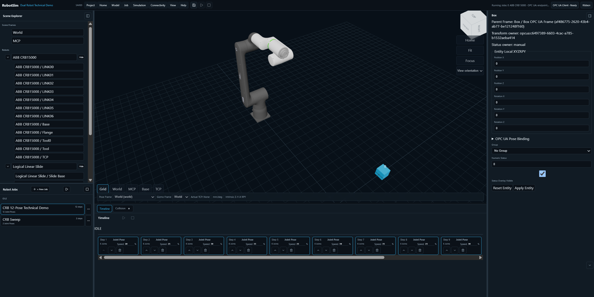

# OpenDigitalTwin



OpenDigitalTwin is a lightweight, browser-first Robot workcell simulator for
small manufacturers and engineering teams that need accessible kinematic and
OPC UA integration checks without adopting a full Unity, Unreal, or industrial
physics toolchain. The current release uses one deterministic Project V4 model
for multiple independent Robot Instances, scene objects, Robot-owned Simulation
Jobs, geometric collision checks, and an optional Runtime Gateway with read-only
OPC UA Server and Client/Bridge subscriptions.

It is an engineering visualization tool, not a Robot controller, physics engine,
or safety-rated system.

## Built with Codex and GPT-5.6

This project was developed with Codex powered by GPT-5.6 as an engineering copilot.

Codex/GPT-5.6 was used to:

- design and iterate the Project V4 multi-robot data model and runtime contracts;
- implement and review the browser simulator, per-robot jobs, collision checks, and OPC UA Runtime Gateway;
- generate and refine validation, unit, middleware, and end-to-end test coverage;
- troubleshoot Docker, same-origin runtime routing, and OPC UA integration behavior;
- document reproducible setup, demo flows, limitations, and verification commands.

All final architecture decisions, validation, and repository integration were reviewed and verified by the submitter.

## Current short-term scope

- Project V4 is the only active browser Project format. New, Save, Export,
  Import, reload, and runtime publication use validated canonical JSON.
- A Project can describe up to 16 Robot Instances. Each reusable Robot
  Definition has one through sixteen named revolute or prismatic Joints; runtime
  state, selection, Jobs, rendering, and collision identity are keyed by Robot
  ID rather than a global active Robot.
- Robot STEP source count and Joint count are independent. A Definition may
  reference one through seven Robot STEP sources, including one assembly source,
  and **Model → Import Robot STEP** maps them to `LINK00` through `LINK06`.
  A single assembly STEP is split deterministically from seven primary assembly
  nodes when possible. Imported Robots use an estimated six-axis mechanical
  template; STEP alone does not provide authoritative Joint axes, pivots, limits,
  or zero calibration. There is no per-source 25 MiB or per-Link
  150,000-triangle cap; the aggregate Definition budgets remain
  100 MiB and 600,000 triangles. A Project supports up to 16 Robot instances
  and 16 Robot definitions while retaining the global 512 MiB referenced STEP
  and 3,000,000 visible-triangle budgets.
- The default Project renders the bundled Niryo NED2 Geometry as one Robot with
  `J1` through `J6`. ABB CRB15000 remains available in the Dual-Robot Technical
  Demo sample. The V4 Scene
  also supports primitive Boxes/Cylinders, Groups, visibility, transforms, and
  geometry-proxy collision inspection. Boxes, Cylinders, and imported STEP
  objects have manual XYZ/RPY placement when their transform is manually owned.
- Simulation Jobs belong to one Robot and contain ordered Joint Poses with a
  speed percentage to the next Pose. Different Robots keep independent state and
  execution sessions. Robot STEP import creates and selects an empty Robot-owned
  Job. **Save Current Pose** also creates that Job on demand for older Projects
  whose imported Robot has no Job.
- The browser publishes only a fully matched Project revision and matching
  multi-Robot state to the Runtime Gateway. A missing Gateway does not disable
  local Simulation.
- Runtime Gateway mode is selected per Project: `Off`, `Server`, `Client`, or
  `Bridge`. Client reads configured external OPC UA nodes; Bridge combines that
  client with the read-only Server namespace. Server remains limited to each
  Robot Joint's read-only OPC UA `Double` Actual value.
- The Connectivity workflow is split into four explicit surfaces: **OPC UA
  Settings** owns Endpoints and runtime role, **Connection Monitor** reports
  quality and stale state, **Binding Overview** maps Object/Robot targets by
  stable Namespace URI, and **Docker Run Guide** provides copy-only operator
  commands. The menu no longer changes runtime role directly.
- The standard Docker topology starts both the Nginx web service and the Runtime
  Gateway. Nginx serves the SPA and proxies same-origin `/runtime/` requests;
  the Gateway owns HTTP activation/state endpoints and optional OPC UA port
  `4841`.

Project V4 is a clean break. There is no Legacy Adoption or automatic Project
migration.

## Quick start

Requirements: Node.js `>=22.15.1 <23` and npm `>=11.4.2 <12`.

Browser-only local Simulation:

```powershell
npm install
npm run dev -- --host 127.0.0.1 --port 5173
```

Open [http://127.0.0.1:5173/](http://127.0.0.1:5173/). The application remains
usable when `/runtime` is unavailable; Gateway status is reported separately.

To add custom Robot Geometry, open **Model → Import Robot STEP**, select one to
seven `.step`/`.stp` sources, confirm the LINK mapping, and choose the source
X/Y/Z-Up convention. Files named with `LINK00` through `LINK06` map explicitly;
other filenames fill the first free Link. Raw sources are retained in the local
browser asset database so the imported Geometry can be restored after reload.
See [Working Demo known limitations](docs/operator/working-demo-known-limitations.md)
before using an inferred Robot definition for TCP or mechanical-dimension work.

Build and run the Runtime Gateway directly for HTTP/OPC UA integration tests:

```powershell
npm run build:gateway
npm run runtime:gateway
```

The direct Gateway defaults are HTTP `http://127.0.0.1:8081` and OPC UA
`opc.tcp://127.0.0.1:4841`. The browser expects a same-origin `/runtime` route,
so Docker Compose is the supported full browser-plus-Gateway topology.

## Two-Robot Technical Demo flow

1. Open **Project → Samples → Dual-Robot Technical Demo**.
2. Select **ABB CRB15000**, then select **CRB 12-Pose Technical Demo** in Robot
   Jobs. The Timeline contains 12 Joint Poses with per-transition speeds.
3. Press **Start Job**. The approximately 5.2-second sequence moves J1 through
   +60° and -60°, follows all 12 Poses, reaches **SUCCEEDED**, and returns J1-J6
   to the Home value `0`.
4. Select **Logical Linear Slide** and run **Linear Slide Traverse** to verify
   that each Robot keeps independent Joint values and Job state.
5. Open **Connectivity > OPC UA Settings**, choose **Server**, and Apply to
   activate the Gateway namespace. Verify it in **Connection Monitor**.
6. Read the Joint Actual nodes with an external OPC UA Client. Node IDs are
   deterministic:

   ```text
   ns=2;s=RobotSim/Robots/<robotId>/Joints/<jointId>/Actual
   ```

The second sample Robot is deliberately a source-only, one-axis prismatic
`RobotDefinition`. It has logical Links, one `SLIDE_X` Joint, Jobs, and OPC UA
state, but no Geometry occurrences and no imported STEP mesh. It proves
multi-Robot identity and data flow; it does **not** prove MRb05 assembly
extraction, mechanical correctness, or a second rendered industrial Robot.
The full Pose table, acceptance checks, and remaining scope checklist are in the
[12-Pose Technical Demo guide](docs/operator/technical-demo-12-pose.md).

## OPC UA Client ObjectPos demo

This is the recommended technical-demo path. The included local OPC UA Server
reproduces the `Sample6X` data shape and deterministic motion from the supplied
B&R Automation Studio TrakDemo: 20 moving Object poses and one six-axis Robot
job sequencer. No PLC or Automation Studio installation is required to run it.

Use three PowerShell terminals after `npm install`:

```powershell
# Terminal 1: deterministic OPC UA Server (anonymous, None/None)
npm run demo:opcua-server

# Terminal 2: OpenDigitalTwin Runtime Gateway
npm run build:gateway
npm run runtime:gateway

# Terminal 3: browser application
npm run dev -- --host 127.0.0.1 --port 5173
```

Then:

1. Open [http://127.0.0.1:5173/](http://127.0.0.1:5173/).
2. Choose **Project > Samples > Dual-Robot Technical Demo**.
3. Open **Connectivity > OPC UA Settings**, add
   `opc.tcp://127.0.0.1:4840`, choose **Client**, and Apply. Then use
   **Binding Overview** to map Object moving frames to the demo Namespace URI.
4. Confirm the Gateway status becomes connected and the Boxes move around the
   track. Select a Box to verify that its transform owner is OPC UA.

The compatibility namespace is
`http://br-automation.com/OpcUa/PLC/PV/` at namespace index `5`. Object pose
leaves are `Double` values at
`ns=5;s=::Sample6X:ObjectPos[0..19].X/Y/Z/Roll/Pitch/Yaw`. XYZ values are
millimetres and the built-in binding converts them to metres; RPY values are
degrees. The Server also exposes `Rob.Q1` through `Rob.Q6`, `Rob.Status`,
`JobID`, `Job1` through `Job20`, and a writable Int32 `Button`. An external OPC
UA Client can write `1` to `ns=5;s=::Sample6X:Button` to start the Robot job
sequence or `2` to stop it. OpenDigitalTwin's Gateway intentionally reads these
external nodes and does not issue that motion command.

Override the demo listener when required:

```powershell
$env:DEMO_OPCUA_PORT = '4842'
$env:DEMO_OPCUA_ADVERTISED_HOST = '127.0.0.1'
npm run demo:opcua-server
```

If the port changes, update the Project binding endpoint accordingly. The demo
Server is local development infrastructure: anonymous access and Security
Policy None are intentional and must not be used as a production security
configuration. See the complete [Object OPC UA live binding guide](docs/operator/opcua-object-binding.md).

## Runtime Gateway contract

The browser and Gateway exchange exact Project/Revision-qualified JSON:

- `GET /healthz` - process liveness.
- `GET /readyz` - `503` before a Project revision is active, then `200`.
- `GET /runtime/status` - active Project, revision, mode, and OPC UA endpoint.
- `PUT /runtime/project` - validate and atomically activate one Project V4.
- `POST /runtime/state` - publish one validated multi-Robot Joint batch for the
  exact active revision; Server or Bridge mode only.
- `/runtime/ws` - stream revision-fenced OPC UA Client/Bridge state batches to
  the browser over a same-origin WebSocket.

Project bodies are bounded to 1 MiB. Runtime state uses the Project V4 runtime
batch budget. Unknown Robots/Joints, duplicate Robots, non-finite values, and
stale revisions are rejected before publication.

The OPC UA namespace URI is `urn:web-digital-twin:robot-sim:v4`. Actual Joint
variables are read-only and the Server namespace is derived from Robot
Definitions.

## Docker deployment

```powershell
$env:ROBOTSIM_OPCUA_PORT = '4841'
$env:ROBOTSIM_OPCUA_ADVERTISE_HOST = '127.0.0.1'
docker compose up -d --build --wait
docker compose ps
Invoke-WebRequest http://127.0.0.1:8080/healthz
Invoke-WebRequest http://127.0.0.1:8080/runtime/healthz
Invoke-WebRequest http://127.0.0.1:8080/runtime/readyz
Invoke-WebRequest http://127.0.0.1:8080/runtime/status
```

Open [http://127.0.0.1:8080/](http://127.0.0.1:8080/). The default published OPC
UA endpoint is `opc.tcp://127.0.0.1:4841`. Docker uses independent endpoints:

```text
Browser                    http://127.0.0.1:8080
Gateway HTTP               runtime-gateway:8081
Gateway OPC UA Client  --> opc.tcp://host.docker.internal:4840  (host PLC Server)
Gateway OPC UA Server  <-- opc.tcp://127.0.0.1:4841             (external PLC Client)
```

Inside the Gateway container, `opc.tcp://127.0.0.1:4840` points back to that
container, not to the Windows PLC. Docker Project Endpoints must use
`opc.tcp://host.docker.internal:4840`. Override host ports when required:

```powershell
$env:WEB_PORT = '9080'
$env:ROBOTSIM_OPCUA_ADVERTISE_HOST = 'robot-sim.example.local'
$env:ROBOTSIM_OPCUA_PORT = '14840'
docker compose up -d --build --wait
```

Set `ROBOTSIM_OPCUA_ADVERTISE_HOST` to the DNS name or IP address that OPC UA
Clients actually use. The Gateway still binds to all container interfaces while
advertising this reachable host in endpoint discovery. Compose automatically
uses the same `ROBOTSIM_OPCUA_PORT` for the container listener, host publication,
and endpoint discovery, avoiding duplicate internal and external endpoint URLs.
Changing listener or advertised endpoint environment values requires a container
restart.

Both containers run with read-only filesystems, dropped Linux capabilities,
bounded process/memory/CPU settings, and temporary writable storage. These
container restrictions are operational limits, not an application security
profile. See the [Docker operator guide](docs/operator/docker-deployment.md).

## Verification

Run the repository gates without relying on a historical test count:

```powershell
npm run lint
npm run test:run
npm run cad:validate
npm run build:gateway
npm run build
npm run test:e2e:v4
npm run deploy:validate
docker compose config --quiet
```

`tests/project-v4-multi-robot.spec.ts` is the browser acceptance path for
loading the two-Robot Project, rendering all 12 CRB Poses, observing positive
and negative intermediate motion, returning Home, preserving the second Robot,
and running its slide Job. Middleware tests start a real `node-opcua` Client and
verify read-only values for both Robots.

## Architecture

```text
Browser SPA
  Project V4 authoring/persistence
  Multi-Robot simulation and Jobs
  Scene/render/collision projection
  Runtime Gateway publisher
          |
          | same-origin /runtime JSON, exact revision
          v
Runtime Gateway
  Project activation and validation
  multi-Robot state publication
  OPC UA Server adapter (read-only Robot Actual values)
  OPC UA Client adapter (read-only external Object values)
          |
          v
External OPC UA Server / Client connections
```

Key code areas:

```text
src/core/project-v4             closed Project contracts and validation
src/core/robot-runtime          variable-Joint frames and serial kinematics
src/features/project/v4         V4 persistence, mutation, and publication
src/features/robot/v4           definition-driven Robot rendering
src/features/jobs/v4            per-Robot Job authoring and execution
src/features/collision/v4       Robot-qualified geometric collision
src/features/runtime-gateway/v4 browser HTTP publisher
middleware/runtime-gateway      HTTP activation and OPC UA Server/Client adapters
```

## Deliberate limitations

- No authentication, authorization, TLS, OPC UA signing/encryption, certificate
  trust workflow, or public-internet hardening.
- No controller writes, command nodes, external motion control, or arbitrary
  Server-node authoring. Client/Bridge Object bindings are read-only inputs.
- No physics response, dynamics, mass/inertia, force/torque, IK, Cartesian path
  planning, reachability solving, or coordinated multi-Robot synchronization.
- No automatic STEP assembly splitting, Link/Joint inference, mesh
  simplification, or API/harness-based semantic conversion.
- Robot STEP Import does not split one assembly source into movable subparts.
  It maps each whole source to one Link and applies the built-in six-axis
  mechanical template. Arbitrary mechanical axes, origins, and limits still
  require a later deterministic authoring workflow and human confirmation.
- No generic Attach/Detach pick-place runtime. The Hackathon Handover sample
  owns one bounded transient attachment and ownership flow.
- The NED2 Direct Handover Hackathon sample is sample-specific choreography,
  not a generic scheduler or planner. It uses fixed Joint keyframes, no physics
  or IK, a local simulated Grip Confirm, and no safety-rated validation.
- No Legacy Project adoption. Unsupported Projects are rejected without
  mutating the active V4 revision.

## Documentation

- [Project V4 multi-Robot and Runtime Gateway design](docs/superpowers/specs/2026-07-16-project-v4-multi-robot-runtime-gateway-design.md)
- [Runtime Gateway middleware notes](middleware/README.md)
- [Docker operator guide](docs/operator/docker-deployment.md)
- [Object OPC UA live binding](docs/operator/opcua-object-binding.md)
- [Build Log](BUILDLOG.md)
