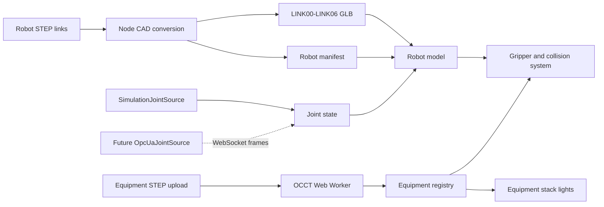

# CRB 15000 Web Robot Simulation Design

**Date:** 2026-07-10
**Status:** Approved for implementation planning
**Scope:** Browser-only simulation with a future OPC UA joint-angle adapter boundary

## 1. Objective

Build an industrial-style web application that renders and animates the supplied ABB CRB 15000 robot link geometry, lets an operator interact with cups and imported equipment in a 3D workcell, and displays each equipment item's state through a reusable red/yellow/green stack-light asset.

The first release runs without a backend. It controls six joints from the browser, supports joint presets and keyframe playback, detects collisions, and supports gripper-based pick and place. A future OPC UA integration can replace the browser joint-angle source without changing the robot renderer or interaction logic.

## 2. Decisions

- Runtime: React, Vite, TypeScript, Three.js, and React Three Fiber.
- CAD pipeline: keep the supplied STEP files as source assets; preconvert robot links to GLB for runtime delivery.
- Equipment import: parse user-supplied STEP files in an `occt-import-js` Web Worker.
- Robot control: joint-space controls only in the first release; no inverse kinematics.
- Interaction: gripper attach/release, pick and place, collision detection, collision highlighting, and automatic playback pause.
- Physics: use sensor and kinematic collision behavior; do not simulate full rigid-body dynamics or fluids.
- Connectivity: implement a `JointAngleSource` contract and browser simulation provider. Do not implement a live OPC UA gateway or modify PLC code in this release.
- Persistence: store imported equipment and scene metadata locally with IndexedDB.
- Primary UX: desktop industrial workstation; narrow layouts collapse the side panels into drawers.

## 3. Authoritative Inputs and Constraints

The workspace initially contains seven SolidWorks 2022 STEP AP214 files:

- `LINK00` through `LINK06`, representing the robot base and six moving links.
- Total source size is approximately 12.1 MiB.
- The link solids use a common assembled zero-pose coordinate frame rather than local joint origins.
- `LINK00`, `LINK01`, `LINK02`, `LINK03`, `LINK04`, and `LINK06` use millimetres.
- `LINK05` uses inches and must be normalized by the CAD importer before conversion to the metre-based web scene.
- The files include presentation colors but do not include joint pivots, axes, limits, parent-child relationships, URDF data, or Denavit-Hartenberg parameters.

The adjacent B&R Automation Studio project includes the OPC UA package, but its global variables, mapping files, OPC UA configuration, tasks, and programs do not currently define robot joint values. This web release therefore does not change or build the AS6 project.

## 4. System Architecture



The browser application has five independent feature boundaries:

1. **CAD assets:** deterministic conversion and loading of robot links and equipment.
2. **Robot kinematics:** manifest-driven link hierarchy and joint transforms.
3. **Joint source:** simulation now and an OPC UA gateway adapter later.
4. **Interaction:** selection, placement, collision detection, and gripper attachment.
5. **Equipment state:** equipment registry, status editing, and stack-light rendering.

## 5. CAD Asset Pipeline

### 5.1 Robot assets

A Node conversion command reads each supplied STEP file with `occt-import-js`, requests metre output, preserves face colors and normals, and exports one binary GLB per link. The generated files retain stable names `LINK00` through `LINK06`.

The conversion report records:

- source path and checksum;
- detected source unit;
- output unit;
- vertex and triangle counts;
- bounding box;
- material/color count;
- conversion warnings.

Validation rejects an empty mesh, non-finite or zero-volume bounds, a missing link, or an assembled robot bound smaller than 0.5 m or larger than 3.0 m on its longest axis. The source STEP files remain the authoritative geometry and generated GLBs can be recreated.

### 5.2 Equipment import

The application accepts `.step` and `.stp` files through an import dialog. A dedicated Web Worker performs STEP parsing so CAD tessellation does not freeze the main UI.

The import flow is:

1. Validate extension and a 100 MiB default file-size ceiling, which remains an application configuration value.
2. Parse with explicit metre output and the balanced tessellation preset: `linearDeflectionType = bounding_box_ratio`, `linearDeflection = 0.001`, and `angularDeflection = 0.5` radians.
3. Return indexed positions, normals, triangle indices, hierarchy, colors, and bounds.
4. Show a preview with detected unit, dimensions, orientation, and origin.
5. Let the operator set name, unit override, scale, origin, graspable flag, collision bounds, and stack-light anchor.
6. Register the asset and cache the original bytes plus scene metadata in IndexedDB.

The runtime renderer consumes Three.js geometry, not STEP directly after registration. Object URLs, geometries, materials, and worker resources are disposed when an asset is removed.

## 6. Robot Kinematics

The robot manifest is versioned separately from the meshes. It defines:

```ts
type JointAxis = readonly [number, number, number]
type Point3 = readonly [number, number, number]

interface RobotJointDefinition {
  id: 'J1' | 'J2' | 'J3' | 'J4' | 'J5' | 'J6'
  parentLink: string
  childLink: string
  pivotInZeroPoseMeters: Point3
  axisInParentFrame: JointAxis
  minDeg: number
  maxDeg: number
  zeroOffsetDeg: number
}
```

The common-coordinate meshes are inserted into nested pivot groups. The loader converts zero-pose world pivots into parent-relative transforms and places each mesh so that an all-zero joint vector exactly reconstructs the original STEP assembly.

Joint pivots and axes are authored from the supplied zero-pose CAD and checked against ABB CRB 15000 documentation. Acceptance checks verify that:

- zero pose does not separate adjacent housings;
- each joint rotates around the visible center of its joint housing;
- rotating one joint moves its child link and all descendants but no ancestors;
- configured limits agree with the CRB 15000-12/1.27 variant;
- end-to-end reach is consistent with the 1.27 m model.

The manifest carries a calibration version so a later authoritative RobotStudio or URDF export can update kinematics without replacing the renderer.

## 7. Joint Data Contract

```ts
type JointAnglesDeg = readonly [number, number, number, number, number, number]

interface JointFrame {
  anglesDeg: JointAnglesDeg
  timestampMs: number
  quality: 'GOOD' | 'UNCERTAIN' | 'BAD' | 'STALE'
}

interface JointAngleSource {
  readonly mode: 'simulation' | 'opcua'
  connect(): Promise<void>
  disconnect(): Promise<void>
  subscribe(listener: (frame: JointFrame) => void): () => void
}
```

`SimulationJointSource` emits browser-controlled angles. The store validates length and finite values, clamps commands to manifest limits, and interpolates the rendered pose to avoid jumps.

The future `OpcUaJointSource` connects only to a browser-safe WebSocket gateway. The gateway will subscribe to six OPC UA `REAL` or `LREAL` process variables and forward joint frames. The browser never attempts direct `opc.tcp` access.

For `BAD` data or a frame age greater than 1,000 ms, the robot holds the last good pose, disables playback, and displays `BAD` or `STALE` prominently. No future OPC UA adapter is allowed to write PLC values through this contract.

## 8. Simulation and Interaction

### 8.1 Joint control

The robot inspector provides a slider and numeric field for each joint, plus Home, Reset, pose-save, and keyframe actions. Keyframes contain six angles, duration, and easing. Playback interpolates joint space and can be paused, stopped, or reset.

### 8.2 Selection and equipment placement

Ray picking selects the robot or an equipment item. Equipment selection exposes a transform gizmo and inspector controls for position, rotation, scale, status, graspability, and collision bounds. Camera orbit is suspended while dragging a gizmo.

### 8.3 Gripper and pick/place

The first release includes a generic parallel gripper at the robot TCP. A sensor volume determines which graspable equipment is eligible. Closing the gripper attaches the nearest eligible item while preserving its world transform. The attached item follows the TCP. Opening the gripper detaches it while preserving the release transform and snaps a vertical gap of 2 mm or less to the work surface.

Only one item can be held at a time. Closing with no eligible target produces a non-blocking notice. Removing a held asset first releases and disposes it safely.

### 8.4 Collision behavior

Rapier sensor colliders represent the robot links, work surface, cups, and imported equipment. The first release uses simplified bounding shapes or convex hulls rather than full triangle-mesh dynamics.

On collision:

- involved objects receive a red outline;
- the event log records the pair and timestamp;
- keyframe playback pauses automatically;
- manual jogging remains available so the operator can move away from the collision.

## 9. Equipment Status and Stack-Light Asset

```ts
type EquipmentStatus = 'OFF' | 'RUNNING' | 'WARNING' | 'FAULT'
```

The status mapping is fixed:

| Equipment status | Red | Yellow | Green |
|---|---:|---:|---:|
| `OFF` | off | off | off |
| `RUNNING` | off | off | on |
| `WARNING` | off | on | off |
| `FAULT` | on | off | off |

The reusable 3D stack light consists of a dark industrial base, metal stem, black separators, and three translucent lenses. The active lens uses emissive material and a restrained point light; inactive lenses remain visible but dim. The model is generated as a reusable Three.js component so it can be attached to built-in or imported equipment without requiring another CAD file.

Each equipment record has an optional local stack-light anchor. When absent, the importer proposes an anchor above the equipment bounding box and allows the operator to reposition it.

## 10. User Interface

The primary screen is a dense but readable industrial workstation:

- **Top bar:** product name, `SIMULATION` source mode, source quality, render statistics, and STEP import action.
- **Left asset tree:** robot links, equipment list, visibility, selection, and status color.
- **Center viewport:** full-height 3D workcell, grid, camera controls, selection outline, transform gizmo, robot, cups, equipment, and stack lights.
- **Right inspector:** joint controls for the robot or transform/status/import properties for equipment.
- **Bottom rail:** playback controls, keyframe timeline, and collision/gripper event log.

The visual direction uses a graphite background, neutral steel surfaces, restrained cyan interaction accents, and semantic red/yellow/green only for operational states. UI chrome uses compact, deliberate typography and square-to-moderate radii rather than consumer-style cards.

Below 960 CSS pixels, the left and right panels become drawers and the event rail becomes a collapsible sheet. The 3D viewport remains usable, but desktop operation is the primary target.

Before coding the interface, a complete 1440 x 900 desktop concept and a 768 x 1024 narrow-screen state will be generated and approved. The accepted concepts become the visual implementation references.

## 11. State and Persistence

Transient app state includes selection, camera, hover, live collisions, playback, and gripper state. Persistent scene state includes imported equipment bytes, transforms, status, collision settings, stack-light anchors, saved poses, and keyframes.

IndexedDB stores binary equipment data and structured scene records. A schema version enables migrations. Corrupt or incompatible records are skipped individually and reported without preventing the rest of the scene from loading.

## 12. Error Handling

- A corrupt or unsupported STEP file fails inside the worker and leaves the existing scene untouched.
- Ambiguous units require explicit operator confirmation before registration.
- CAD conversion warnings appear in the import result and event log.
- A missing robot GLB produces a link-specific diagnostic and prevents misleading partial simulation.
- Invalid joint frames are rejected and surfaced in source diagnostics.
- `BAD` or stale future OPC UA data holds the last good pose.
- WebGL or WebAssembly initialization failures show actionable diagnostics instead of a blank canvas.
- IndexedDB failures fall back to the current in-memory session with a persistence warning.

## 13. Verification Strategy

### 13.1 Automated tests

- Unit tests for joint validation, limits, interpolation, keyframes, source quality, status mapping, and persistence serialization.
- Kinematic hierarchy tests proving each joint moves exactly its child subtree.
- Import adapter tests using a small STEP fixture, unit normalization, materials, bounds, cancellation, and parse failure.
- Interaction tests for selection, attach, TCP following, release, collision entry/exit, and automatic playback pause.
- Component tests for joint controls, equipment inspector, import dialog, source diagnostics, and status controls.

### 13.2 Asset verification

- Convert all seven supplied STEP files.
- Assert seven non-empty GLBs with finite bounds and materials.
- Verify `LINK05` is normalized from inches and aligns with adjacent zero-pose links.
- Verify the all-zero manifest reconstructs the common STEP assembly.
- Inspect representative converted links visually to confirm embedded colors survive conversion.

### 13.3 Browser verification

- Load the complete workcell.
- Jog every joint and verify descendants visually and through transform assertions.
- Save and play a multi-keyframe pose sequence.
- Pick up a cup, move it with the TCP, release it, and confirm the resulting transform.
- Trigger a collision and verify highlighting, log entry, and playback pause.
- Switch an equipment item through all four statuses and verify the stack light.
- Import a STEP fixture, configure it, reload the page, and verify restoration.
- Exercise desktop and narrow layouts without clipped primary controls or viewport overflow.

### 13.4 Completion commands and evidence

- Type checking and linting.
- Unit and component test suite.
- Production build.
- CAD conversion and asset validation command.
- Browser end-to-end tests for the core workflow.
- Browser screenshots compared directly with the approved concepts using image inspection.
- Final requirement-by-requirement audit against this specification.

No Automation Studio build is required because this release does not modify the AS6 project. No PLC deployment, transfer, restart, or variable write is in scope.

## 14. Acceptance Criteria

The work is complete only when all of the following are proven in the current workspace:

1. The rendered robot uses geometry converted from all seven supplied CRB 15000 STEP links.
2. Six joint controls animate a correct parent-child hierarchy within configured limits.
3. Simulation mode operates entirely in the browser.
4. The joint renderer consumes the documented `JointAngleSource` contract and includes a simulation provider plus a future OPC UA adapter boundary.
5. Operators can import a STEP equipment file through the application and place it in the scene.
6. Built-in cups and imported equipment can be selected, moved, detected by the gripper, picked, carried, and released.
7. Collisions are detected, highlighted, logged, and pause keyframe playback.
8. Each equipment item supports `OFF`, `RUNNING`, `WARNING`, and `FAULT` and can display the reusable 3D red/yellow/green stack light.
9. Imported assets and scene state survive a page reload in the same browser.
10. Automated tests, production build, asset validation, browser workflows, responsive checks, and visual comparison all pass.

## 15. Explicitly Out of Scope

- Inverse kinematics or Cartesian TCP dragging.
- Full rigid-body dynamics, liquid simulation, splashing, or fluid volume tracking.
- Live OPC UA connectivity, certificates, PLC variable definitions, PLC writes, or AS6 project changes.
- Multi-user synchronization or cloud asset storage.
- Safety-rated robot behavior or use as a substitute for ABB RobotStudio or a real safety controller.

## 16. References

- Supplied STEP source directory: `CRB15000_12kg-127_OmniCore_rev00_STEP_J`
- ABB product manual: <https://library.e.abb.com/public/bda8d3f453de450699b18946b7d3ba02/3HAC077389%20PM%20CRB%2015000-en.pdf>
- `occt-import-js`: <https://github.com/kovacsv/occt-import-js>
- React Three Fiber model loading: <https://r3f.docs.pmnd.rs/tutorials/loading-models>
- React Three Rapier: <https://pmndrs.github.io/react-three-rapier/>
