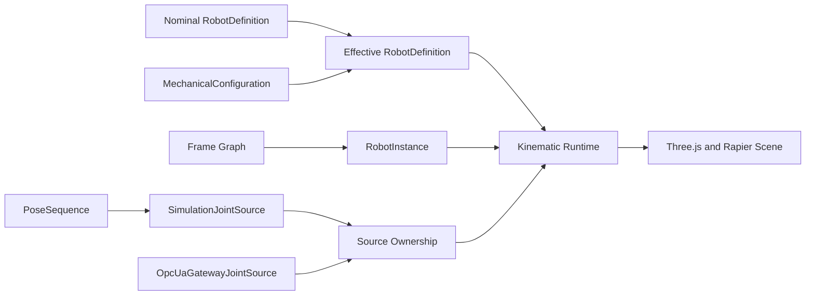

# Frame Graph, Generic Robot Import, OPC UA, and Pose Sequence Design

**Status:** Approved as written on 2026-07-11

**Planning refinement:** Post-approval implementation-plan reviews tightened
multi-instance frame identity, per-geometry robot assets, read-only gateway
authorization/lifecycle, committed frame revisions, per-instance mutation
arbitration, and legacy-Pose source truth. These clarifications do not change
the approved feature scope or operator behavior; they make the implementation
contracts below unambiguous and executable.

**Extends:** `2026-07-10-robot-simulation-design.md`

## 1. Purpose

Extend the current CRB15000 browser simulation so operators can place robots,
machines, tools, coordinate frames, and equipment at non-fixed poses; import
other robot mechanisms; apply versioned mechanical-dimension overrides; ingest
joint positions from OPC UA in addition to Simulation Mode; and reorder poses
with velocity-limit-aware segment speeds.

The extension preserves the current supplied CRB15000 STEP geometry as the
first built-in robot while removing runtime assumptions that every robot has
exactly six joints named J1 through J6 or seven links named LINK00 through
LINK06.

## 2. Delivery Roles

The requested workflow is represented in every artifact and review gate:

- **SOL-Ultra / Planning:** research, specification, implementation plans, and
  acceptance matrices.
- **Terra / Implementation:** TDD implementation tasks and code-level fixes.
- **Luna / Documentation:** operator guide, manifest reference, OPC UA gateway
  guide, migration notes, and verification record.

The current Codex environment does not expose a subagent model selector, so it
cannot guarantee the literal model behind each worker. It will preserve these
roles as independent work and review stages and will record the role on the
resulting artifacts.

## 3. Research Conclusions and Terminology

`Machine Centric Point` is not treated as a cross-vendor ISO robot frame. In
this application, MCP is explicitly defined as follows:

> **MCP / Machine-Centric Point:** an editable six-dimensional frame that
> represents the origin and orientation of one machine or coordinated machine
> group. Although its display name contains “Point,” its stored value is a full
> pose.

The model follows the frame-hierarchy concepts used by industrial robot and
machine systems rather than hard-coding vendor-specific names. References:

- ISO 9787 robot coordinate systems:
  https://www.iso.org/standard/59444.html
- ABB RobotStudio world, base, task, tool, and workobject frames:
  https://library.e.abb.com/public/425d1cfdb2ed475eadc6229a1588fb92/3HAC032104%20OM%20RobotStudio-en.pdf
- B&R frame hierarchy for Machine-Centric Robotics:
  https://www.br-automation.com/tr/hakkimizda/basin-odasi/in-sync-with-robots-15-04-2019/
- Siemens machine and workpiece coordinate systems:
  https://support.industry.siemens.com/cs/attachments/109925704/MC_ncprogramming_progr_man_0124_en-US.pdf
- OPC UA Robotics information model:
  https://reference.opcfoundation.org/specs/OPC-40010-1/full

## 4. Goals

1. Represent World, MCP, Robot Base, derived joint/link frames, Flange/Tool0,
   named TCPs, fixtures, workobjects, equipment, sensors, cameras, and moving
   frames in one validated hierarchy.
2. Let operators manually edit MCP, Robot Base, TCP definitions, fixtures,
   workobjects, sensors, and equipment with numeric values or 3D transform
   controls.
3. Import robots through STEP plus a Robot Definition Manifest, with a manual
   setup wizard when the manifest is absent.
4. Import resolved URDF as the first standards-based adapter and convert it to
   the same internal robot definition.
5. Support a variable-size rooted acyclic kinematic tree containing fixed,
   revolute, continuous, and prismatic joints.
6. Apply versioned mechanical overrides without modifying the nominal robot
   definition.
7. Preserve the existing Simulation Joint Source while adding a read-only OPC
   UA gateway source and explicit source ownership.
8. Let operators reorder saved poses and set the speed from each pose to the
   next as a percentage of robot joint velocity limits.
9. Persist definitions, configurations, instances, frames, mappings, poses,
   and sequences in the browser and recover them safely after reload.

## 5. Non-Goals

- Inverse kinematics, Cartesian jogging, or dragging the robot TCP to command
  a new robot pose.
- Arbitrary parametric deformation of imported STEP topology.
- Parallel or closed-loop kinematics, planar/floating joints, or a generic
  coupled-joint solver in the first release.
- Full Xacro execution or full SDF support in the browser.
- Dynamic force, torque, inertia, or safety-rated motion simulation.
- Browser-to-PLC writes, OPC UA method calls that start motion, PLC program
  changes, PLC transfer, or deployment to a controller.
- Direct browser `opc.tcp` connections or storing OPC UA private keys in the
  browser.

## 6. Architecture



The domain is split into four independently testable subsystems:

1. **Frame Graph and manual transforms**
2. **Generic robot definition, import, and mechanical configuration**
3. **Dynamic joint state and OPC UA gateway source**
4. **Simulation Pose Sequence speed and ordering**

The existing collision-aware equipment transform and pick/place work remains
the baseline. Equipment transforms migrate into the frame graph without
changing their saved world pose.

## 7. Coordinate Convention

- Right-handed coordinate system.
- Scene root is Z-up.
- Internal length unit is metres.
- Internal revolute joint and orientation unit is radians.
- Internal orientation storage is a normalized quaternion `[x, y, z, w]`.
- The UI may display millimetres or metres and degrees or radians, but every
  field displays its active unit.
- UI rotation fields are explicitly labelled Roll X, Pitch Y, and Yaw Z. They
  compose as `q = qz(yaw) * qy(pitch) * qx(roll)`; quaternion storage prevents
  Euler display singularities from becoming persisted ambiguity.
- Imported units and every conversion are retained as provenance.
- A STEP Manifest package unit applies to all length-valued wire fields,
  including Pose translations, collision extents, and prismatic Home/limits/
  zero offset/velocity/acceleration; revolute values remain radians. Conversion
  to canonical m, m/s, and m/s^2 occurs exactly once before validation.
- A stored local pose always means `T_parent_child`.
- A world pose is calculated by composing every ancestor transform.

```ts
export interface Pose3D {
  readonly position: readonly [number, number, number]
  readonly quaternion: readonly [number, number, number, number]
}
```

Every transform must contain finite numbers and a normalizable quaternion.

## 8. Frame Graph

### 8.1 Frame roles

```ts
export type FrameRole =
  | 'world'
  | 'machine'
  | 'robot-base'
  | 'joint'
  | 'link'
  | 'flange'
  | 'tcp'
  | 'fixture'
  | 'workobject-user'
  | 'workpiece'
  | 'equipment'
  | 'sensor'
  | 'camera'
  | 'moving'
  | 'custom'

export interface FrameNode {
  readonly id: string
  readonly name: string
  readonly role: FrameRole
  readonly parentId: string | null
  readonly localPose: Pose3D
  readonly ownerEntityId: string | null
  readonly source: 'manual' | 'derived' | 'runtime'
  readonly editable: boolean
}
```

### 8.2 Hierarchy and edit rules

```text
World / Cell
└─ MCP
   ├─ Robot Base
   │  └─ Joint and Link frames (derived)
   │     └─ Flange / Tool0 (derived)
   │        ├─ TCP 1..N
   │        └─ Tool-mounted Sensor / Camera
   ├─ Fixture / Workobject User
   │  └─ Workpiece / Object
   ├─ Machine-mounted Sensor / Camera
   └─ Conveyor / Pallet / Turntable moving frame
      └─ Fixture / Object
```

- World is the one immutable root.
- A cell may contain multiple MCP frames; each machine group and RobotInstance
  selects its MCP parent explicitly.
- Every non-root frame has exactly one parent.
- Frame IDs are unique and the graph must be acyclic.
- Cell-scoped IDs are globally unique. A reusable robot definition contains
  definition-local frame IDs only; materialization prefixes every scene ID with
  `robot:<robotInstanceId>:` so two instances can never collide.
- MCP, Robot Base, TCP, fixture, workobject, workpiece, equipment, sensor,
  camera, moving, and custom frames may be edited when their source is manual.
- Joint, link, and flange frames produced by forward kinematics are read-only
  during operation.
- Each robot-scoped manual TCP has exactly one persisted scene FrameNode under
  its same-owner derived flange. The FK adapter emits joint/link/flange nodes
  and never emits a duplicate TCP. Tool-mounted manual sensor/camera frames
  parent that persisted TCP rather than the derived flange directly.
- Reparenting preserves the world pose by computing a new local pose.
- Deleting a parent requires explicit child reparenting or subtree deletion;
  implicit orphaning is prohibited.
- Frame-only subtree deletion is rejected when any descendant is an equipment,
  RobotInstance Base, or other entity lifecycle root. The owning entity service
  must perform the cross-store transactional deletion so no entity record can
  reference a missing frame.
- A moving frame carries timestamp, quality, and source metadata outside the
  persisted `FrameNode`; runtime values never overwrite its nominal pose until
  the operator explicitly commits a calibration.

### 8.3 Manual editing

The Frame Inspector provides:

- Reference display: Parent, World, MCP, Robot Base, or another valid frame.
- Numeric X/Y/Z and Rx/Ry/Rz fields with explicit units.
- A 3D transform control for editable frames.
- Preview, Apply, and Cancel.
- Parent selection with preserve-world behavior.
- Axis visualization, visibility control, and copy-as-matrix/copy-as-pose.
- Active TCP selection for each robot instance.

Preview changes are memory-only. Apply performs one validated transaction.
Cancel restores the last committed transform. Robot Base editing moves the
whole robot instance without changing its joint geometry. TCP editing changes
the flange-to-tool offset and does not solve inverse kinematics.
Every persisted frame has a committed transform/topology revision: create is
revision 1, and each committed local-pose or parent change increments it once in
the same transaction. Preview, Cancel, no-op Apply, rename-only edits, and
active-TCP selection do not increment it. The Frame Store exposes a typed
committed-record accessor and post-commit subscription so playback can snapshot
and observe TCP revisions without relying on array identity; revisions survive
reload.

## 9. Generic Robot Model

### 9.1 Canonical definition

```ts
export type RobotJointType =
  | 'fixed'
  | 'revolute'
  | 'continuous'
  | 'prismatic'

export interface RobotJointLimits {
  readonly lower: number | null
  readonly upper: number | null
  readonly maxVelocity: number | null
  readonly maxAcceleration: number | null
  readonly maxEffort: number | null
}

export interface RobotJointDefinitionV1 {
  readonly id: string
  readonly name: string
  readonly type: RobotJointType
  readonly parentLinkId: string
  readonly childLinkId: string
  readonly origin: Pose3D
  readonly axis: readonly [number, number, number] | null
  readonly limits: RobotJointLimits
  readonly homePosition: number
  readonly direction: 1 | -1
  readonly zeroOffset: number
}

export type RobotAssetId = `builtin:${string}` | `sha256:${string}`

export interface RobotGeometryInstanceV1 {
  readonly id: string
  readonly assetId: RobotAssetId
  readonly pose: Pose3D
  readonly scale: readonly [number, number, number]
}

export interface RobotCollisionBoxV1 {
  readonly id: string
  readonly sourceGeometryId: string | null
  readonly pose: Pose3D
  readonly halfExtents: readonly [number, number, number]
}

export interface RobotLinkDefinitionV1 {
  readonly id: string
  readonly name: string
  readonly visualGeometries: readonly RobotGeometryInstanceV1[]
  readonly collisionGeometries: readonly RobotGeometryInstanceV1[]
  readonly collisionBounds: readonly RobotCollisionBoxV1[]
}

export type RobotNamedFrameParentV1 =
  | { readonly kind: 'link'; readonly linkId: string }
  | { readonly kind: 'frame'; readonly frameId: string }

export interface RobotNamedFrameDefinitionV1 {
  readonly id: string
  readonly name: string
  readonly role: 'flange' | 'tcp' | 'sensor' | 'camera' | 'custom'
  readonly parent: RobotNamedFrameParentV1
  readonly localPose: Pose3D
  readonly ownership: 'derived' | 'instance-manual'
}

export interface RobotDefinitionV1 {
  readonly schemaVersion: 1
  readonly id: string
  readonly revision: string
  readonly name: string
  readonly sourceFormat: 'builtin' | 'step-manifest' | 'urdf'
  readonly sourceSha256: string
  readonly sourceAssetIds: readonly RobotAssetId[]
  readonly rootLinkId: string
  readonly links: readonly RobotLinkDefinitionV1[]
  readonly joints: readonly RobotJointDefinitionV1[]
  readonly namedFrames: readonly RobotNamedFrameDefinitionV1[]
  readonly defaultFlangeFrameLocalId: string
  readonly defaultTcpFrameLocalId: string | null
}
```

The first release accepts a rooted acyclic tree. Every non-root link has one
incoming joint. Fixed joints require a null axis; movable-joint axes must be
finite and non-zero. Revolute and prismatic joints require finite lower and
upper limits. Continuous joints have null position limits. Every movable joint
used by percentage-speed Pose Sequence playback requires a finite positive
`maxVelocity`.

Geometry records are per-instance within a link so resolved URDF files can
retain multiple independently transformed and scaled visual/collision elements.
Scale is finite, positive import provenance, not a Mechanical Editor mesh-
deformation control. Collision overrides and approximations are link-level so
they also cover the root link. Named-frame IDs in a definition are local; only
materialized instance FrameNodes receive global scene IDs.
`sourceAssetIds` retains the original manifest/STEP or URDF/resolved-mesh bytes
as provenance; reference-aware GC traverses these IDs as well as runtime
geometry and configuration overrides.

### 9.2 Definition, configuration, and instance

- `RobotDefinitionV1` is immutable nominal data and content-addressed assets.
- `MechanicalConfigurationV1` is a versioned set of overrides for joint
  origins, axes, direction, zero offsets, home values, limits, flange, TCP, and
  per-link visual/collision geometry and approximations, including the root
  link.
- `EffectiveRobotDefinition` is a validated in-memory composition of nominal
  data and one selected configuration.
- `RobotInstanceV1` references a definition revision and configuration
  revision and owns a Robot Base frame, current source/profile selection, and
  active TCP. Current joints and quality are transient per-instance runtime
  state, never persisted in the instance metadata row.
- Multiple instances may reference the same definition and assets.

Mechanical drafts and Apply operations are keyed by explicit RobotInstance ID
plus the base configuration/revision, never by active tree selection or shared
configuration ID alone. Apply rechecks that identity inside its transaction and
updates only the requested instance; another instance sharing the prior
configuration remains unchanged.

Changing a joint origin updates forward kinematics and attached collision
geometry. It does not deform a CAD mesh. If the effective joint dimensions no
longer match the registered visual bounds, the editor shows a persistent
`Geometry mismatch` warning and requires an explicit acknowledgement before
Apply. Operators may select a matching STEP/GLB variant; arbitrary non-uniform
mesh deformation is not provided.

## 10. Robot Import

### 10.1 Input paths

1. **STEP plus Robot Definition Manifest:** preferred production input.
2. **Resolved URDF package:** converted to the canonical definition; Xacro is
   not executed in the browser.
3. **STEP without a manifest:** accepted only through the manual Robot Setup
   Wizard.

SDF is documented as a later adapter. Unsupported formats or constructs are
reported explicitly and never ignored silently.

### 10.2 Setup Wizard

1. Select source files and detect units.
2. Review generated link assets and assign stable link IDs.
3. Define root, parent/child relationships, joint types, origins, and axes.
4. Jog the zero-pose preview and verify link alignment.
5. Define Home, limits, direction, zero offset, and maximum velocity.
6. Define Robot Base mount, Flange/Tool0, and one or more TCPs.
7. Generate or edit simplified collision geometry.
8. Review validation errors, warnings, hashes, and conversion provenance.
9. Commit the definition and assets atomically.

### 10.3 Validation

Import fails before persistence if any of the following holds:

- Duplicate or missing IDs.
- Missing asset or hash mismatch.
- Missing root, unreachable link, multiple parent, or graph cycle.
- Missing parent/child reference.
- Invalid transform or quaternion.
- Missing, zero, or non-finite movable-joint axis, or a non-null fixed-joint
  axis.
- Home outside position limits.
- Invalid limit units or non-positive velocity limits when required.
- Frame attachment cycle.
- Unsupported joint type or URDF construct.
- Empty visual geometry or unreasonable bounds.

Warnings include geometry/kinematics mismatch, missing optional inertia,
generated collision approximation, retained palette-only colors, and converted
source units. A failed transaction leaves the previously active robot and
assets unchanged.

### 10.4 CRB15000 migration

The current CRB15000 joint origins, axes, limits, link assets, world-origin
localization, flange rotation, and material metadata become a committed built-in
`RobotDefinitionV1`. Its exact definition ID/revision are
`crb15000-12kg-127`/`builtin-v1`; the default instance ID is `crb15000-01`.
Migration must prove that:

- zero pose reproduces the current assembled bounds;
- the six current joint motions produce the same link transforms;
- the current gripper/TCP and deterministic Cup 01 pick fixture remain valid;
- any non-empty retiring same-runtime CRB15000 Pose snapshot converts without
  angle changes; a cold upgrade fabricates no legacy Pose row;
- existing collision bounds remain aligned.

## 11. Joint State and Source Ownership

```ts
export type JointSourceMode = 'simulation' | 'opcua'
export type JointSourceStatus =
  | 'CONNECTING' | 'GOOD' | 'UNCERTAIN' | 'BAD' | 'STALE' | 'DISCONNECTED'

export interface NamedJointValue {
  readonly jointId: string
  readonly value: number
}

export interface RobotJointFrame {
  readonly robotInstanceId: string
  readonly definitionRevision: string
  readonly values: readonly NamedJointValue[]
  readonly timestampMs: number
  readonly sequence: number
  readonly quality: 'GOOD' | 'UNCERTAIN' | 'BAD' | 'STALE'
}

export interface RobotJointSource {
  readonly mode: JointSourceMode
  readonly robotInstanceId: string
  connect(): Promise<void>
  disconnect(): Promise<void>
  subscribe(listener: (frame: RobotJointFrame) => void): () => void
  subscribeStatus(listener: (status: JointSourceStatus) => void): () => void
}
```

- Values are matched by stable joint ID, never array position alone.
- Every frame must contain exactly the active definition's movable joints once.
- Unknown, duplicate, missing, non-finite, wrong-revision, or out-of-order
  values are rejected and surfaced as diagnostics.
- Values are normalized to radians or metres before entering the store.
- Limits are applied from the effective definition.
- BAD or frames older than 1,000 ms hold the last good pose and pause playback
  at the current elapsed position; source switching/deletion uses Stop and
  resets elapsed.
- UNCERTAIN updates may render but are visibly identified.
- Switching source stops playback, disconnects the previous source, clears its
  queued frames, and requires a valid initial frame from the new source.
- Source mode and arbitration are owned independently per RobotInstance;
  switching one robot never changes another robot's controls or readiness.
- Each RobotInstance persists a nullable assigned browser profile-selection ID;
  there is no global active-profile fallback after reload.
- Connection/status events use the separate status subscription and can lower
  readiness without fabricating an empty joint frame or changing the last pose.
- Simulation Mode owns manual joint controls and Pose Sequence playback.
- OPC UA Mode locks manual joint controls and Pose Sequence editing/playback.
- A per-RobotInstance Simulation-mutation gate is the authority behind UI
  locks. It combines a monotonic generation, pending-transition token, and
  serialized commit lock. Source/Play requests invalidate queued mechanical or
  Pose writes synchronously; a write already inside the lock finishes while
  Simulation still owns the robot and the transition waits. New writes are
  rejected while a transition is pending, and rollback clears only its exact
  token. Mechanical preview actions perform the same synchronous authority
  check, and source/Play transition cleanup restores any existing preview to
  the committed definition before live motion proceeds.

## 12. OPC UA Gateway

The browser connects to a dedicated WebSocket gateway. The gateway owns OPC UA
certificates, sessions, subscriptions, NodeId mappings, reconnect behavior, and
status conversion. The browser never opens `opc.tcp` and never receives private
keys.

```ts
export interface OpcUaJointBinding {
  readonly jointId: string
  readonly nodeId: string
  readonly sourceUnit: 'degree' | 'radian' | 'millimeter' | 'meter'
  readonly scale: number
  readonly offset: number
  readonly direction: 1 | -1
}

export interface GatewayAllowedProfileV1 {
  readonly schemaVersion: 1
  readonly id: string
  readonly name: string
  readonly robotDefinitionId: string
  readonly robotDefinitionRevision: string
  readonly samplingIntervalMs: number
  readonly bindings: readonly OpcUaJointBinding[]
}

export interface OpcUaBindingProfileV1 {
  readonly schemaVersion: 1
  readonly id: string
  readonly name: string
  readonly gatewayProfileId: string
  readonly robotDefinitionId: string
  readonly robotDefinitionRevision: string
}
```

NodeIds and conversion bindings live only in a validated server-side allowlist
file. The browser persists a profile-ID selection and sends definition plus
RobotInstance identity; it cannot submit or widen NodeIds. The gateway
subscribes to the configured Nodes with OPC UA MonitoredItems and
emits one coherent joint frame containing source timestamp, sequence, and
quality. Partial updates are assembled only when every joint has a value from a
consistent sampling window. The default browser-facing rate is 50 Hz and the
gateway may coalesce faster server updates. It reconnects with bounded backoff
and reports CONNECTING, GOOD, UNCERTAIN, BAD, STALE, and DISCONNECTED states.
One frame assembler belongs to one logical browser subscription, so sequence
numbers remain increasing across upstream OPC UA reconnects; reconnect clears
all partial joint samples before new MonitoredItems feed that assembler. Frame
and status callbacks are separate and generation-guarded. A browser socket
closed while subscribe is pending disposes the late subscription exactly once,
and `profile-accepted` is sent only after subscribe succeeds and the socket is
still current.

The gateway binds loopback by default. A non-loopback bind fails startup unless
the origin allowlist is explicit, reverse-proxy bearer authentication is
enabled, and a server-side upstream token is configured. Each HTTP upgrade must
carry the matching proxy-injected Authorization header; the browser never
stores or sends that token. Origin checking remains defense in depth rather
than authentication.

Browser selection records may be reused, but assignment is explicit per
RobotInstance and definition/revision validated. Assigned profile deletion is
blocked until every referencing instance is unassigned or deleted. While a
selection is assigned, its server profile ID and definition/revision are
immutable; only its display name may change, preventing silent live retargeting.

The first release is strictly read-only. Enabling OPC UA writes later requires
a separate command contract, user authority, range checks, controller state and
safety interlocks, explicit operator confirmation, and a new approved spec.

## 13. Simulation Pose Sequence

```ts
export interface PoseStepV1 {
  readonly id: string
  readonly name: string
  readonly jointPositions: Readonly<Record<string, number>>
  readonly speedPercentToNext: number
  readonly easing: 'linear' | 'easeInOut'
}

export interface PoseSequenceV1 {
  readonly schemaVersion: 1
  readonly id: string
  readonly robotInstanceId: string
  readonly robotDefinitionId: string
  readonly robotDefinitionRevision: string
  readonly mechanicalConfigurationId: string
  readonly mechanicalConfigurationRevision: string
  readonly name: string
  readonly steps: readonly PoseStepV1[]
  readonly updatedAtMs: number
}
```

### 13.1 Speed semantics

- `speedPercentToNext` is an integer from 1 through 100 and belongs to the
  source Pose step.
- The final Pose stores the value for stable editing but does not use it until
  another Pose follows it.
- For every movable joint, calculate `abs(target - source) / (maxVelocity *
  speedPercent / 100)`.
- Segment duration is the maximum calculated joint time so all joints arrive
  together and no joint exceeds its configured velocity limit.
- Linear easing has a peak-velocity factor of 1. Smoothstep `easeInOut` has a
  peak derivative of 1.5, so its duration is multiplied by 1.5.
- Continuous-joint positions remain unwrapped; exact saved displacement is
  respected rather than silently choosing a shortest path.
- Prismatic values and velocity limits use metres and metres per second.
- If every joint delta is zero, the segment completes immediately.
- Missing or invalid velocity limits block playback and identify every joint
  requiring configuration.
- Every non-continuous commanded position is validated against the active
  effective lower/upper limits during bridge conversion, hydration, capture,
  edit, and Play; playback never relies on downstream clamping.

### 13.2 Ordering and playback

- Each sequence belongs to one RobotInstance and one definition/configuration
  revision. A mismatch blocks editing/play until an explicit validation-only
  rebase updates the revision without changing Pose values.
- Operators can reorder steps using drag and drop or keyboard-accessible Move
  Up and Move Down actions.
- The Pose and its outgoing `speedPercentToNext` move together.
- Editing and reordering are disabled while a playback snapshot is active
  (playing or paused) or while OPC UA owns the robot. Only Stop/natural
  completion clears the session and unlocks sequence mutation.
- Play snapshots the full ordered sequence, configuration revision, velocity
  limits, current Simulation source generation, every committed Base-to-World
  ancestor ID/parent/local pose/revision, and active TCP
  ID/parent/local pose/frame revision. Committing or reparenting the same TCP,
  Base, or persisted ancestor pauses/invalidates every affected descendant
  robot run; later state changes cannot mutate an active snapshot.
- Previewing the active TCP, Base, or a persisted Base ancestor likewise first
  pauses/invalidates every affected run, then permits the coordinate draft.
  Coordinate editing remains allowed, but Resume requires Stop plus fresh Play;
  a fresh Play cancels any unapplied relevant preview before snapshotting,
  closes the matching Inspector/gizmo draft, restores committed field values,
  and makes every retained stale Apply token invalid.
- A collision pauses playback at the current segment and retains timeline
  position and immutable snapshot. Resume reuses that exact snapshot and elapsed
  time rather than re-snapshotting; it is blocked while a collision pair remains
  active. Collision exit never auto-resumes.
- Stop clears the snapshot and returns timeline position to zero without
  deleting the sequence. Natural completion also clears the snapshot; every
  later fresh Play starts from zero with current persisted edits.
- A revision change while paused marks the snapshot invalid and requires Stop
  plus a fresh Play.
- Home changes the current robot pose but does not reorder or delete steps.
- Reset clears transient playback and interaction state. Persisted sequence
  deletion requires a separate explicit action.
- Active-sequence selection, reorder, speed/easing edits, add, rename, and
  delete persist atomically in Dexie.
- Sequence schema/envelope validation rejects unknown schema versions, empty or
  oversized identities/names, invalid easing, and non-finite timestamps before
  domain validation.
- UI disabled state is advisory. Every persisted operator mutation rechecks
  Simulation ownership and no active playing/paused session under the shared per-instance gate
  immediately before its transaction, with no DB or memory change on denial.
  Play requests the corresponding transition synchronously and installs its
  immutable snapshot under the same lock.

## 14. User Interface

### 14.1 Asset Tree

The tree contains expandable Frames, Robots, and Equipment groups. Frame nodes
show role, visibility, source, and live quality. Robot nodes show definition,
configuration revision, Base, derived links, Flange, named TCPs, and source
mode.

### 14.2 Inspector

Contextual tabs are:

- **Transform:** reference-frame selector and numeric/3D transform editing.
- **Frames:** parent, role, active TCP, visibility, and frame diagnostics.
- **Mechanical:** nominal versus override joint and collision data.
- **Joints:** manual joint controls and source diagnostics.
- **Sequence:** ordered Poses, outgoing speed, calculated duration, and
  playback controls.
- **OPC UA:** read-only endpoint status and per-joint binding diagnostics.

### 14.3 Robot Import

Robot Import is distinct from Equipment STEP Import. Equipment import remains a
single rigid-body workflow; Robot Import is a multi-link kinematic wizard. The
two may share unit detection, OCCT conversion, geometry budgets, IndexedDB
asset storage, and error presentation but not domain records.

## 15. Persistence

Dexie stores separate versioned records for:

- robot definitions and source provenance;
- content-addressed source and runtime assets;
- mechanical configurations;
- robot instances;
- persisted manual frame nodes;
- reusable browser OPC UA profile-ID selections plus each RobotInstance's
  nullable assignment, without NodeIds, credentials, or private keys; full
  binding profiles remain in the server allowlist;
- named Poses, ordered Pose Sequences, and per-RobotInstance active-sequence
  selections;
- existing equipment and imported equipment.

Hydration is single-flight and StrictMode-safe. Corrupt records are isolated per
row and reported without preventing valid records from loading. Schema
migrations copy the current CRB15000 state to the built-in definition. The
baseline did not persist legacy fixed-six keyframes, so a cold upgrade has no
durable Pose row to recover and must not fabricate one. A same-runtime retiring
memory snapshot, when non-empty, is converted once to joint-ID records through
an explicit compatibility adapter and marker. Every durable migration and this
conversion bridge are idempotent and covered by reopen/source-truth tests.
Deleting a RobotInstance deletes its owned Pose Sequences and active selection
in the same transaction; sequences for other instances and shared robot assets
remain intact.

## 16. Error Handling

- Invalid manual numeric input remains a draft and cannot be applied.
- Frame cycles, invalid reparenting, and deleting required derived frames are
  rejected before state mutation.
- Definition or configuration validation failures leave the previous effective
  robot active.
- Asset conversion cancellation disposes partial resources and leaves no
  persisted robot.
- OPC UA disconnect or BAD/STALE data holds the last good pose and never falls
  back to Simulation without explicit operator action.
- A definition-revision mismatch blocks joint frames and Pose playback.
- Collision or source-quality pause events are timestamped in the existing
  event log.
- Persistence failure enters explicit memory-only mode and presents a retry or
  export path.

## 17. Testing and Acceptance

### 17.1 Unit and integration tests

- Pose composition, inverse, relative conversion, and preserve-world reparent.
- Frame cycle, missing parent, duplicate ID, and subtree-delete validation.
- Robot definition topology, joint axis, limits, units, and asset validation.
- Multi-geometry pose/scale retention, link-level collision overrides, and
  definition-local to instance-namespaced frame materialization.
- Mechanical override composition and immutable nominal definitions.
- CRB15000 zero-pose and known joint-transform parity before and after
  migration.
- STEP Manifest and resolved URDF adapter fixtures.
- Import transaction rollback and corrupt-row isolation.
- Named joint frame validation, source switching, out-of-order rejection,
  revision mismatch, quality, and stale handling.
- OPC UA binding unit, scale, offset, and direction normalization.
- Server profile allowlisting, client NodeId rejection, loopback defaults, and
  authenticated non-loopback upgrade rejection.
- Pose segment duration for revolute, continuous, and prismatic joints;
  ease-in-out peak velocity; zero-distance segments; and missing limits.
- Pose add, rename, speed/easing edit, per-instance selection, bounded-position
  validation, reorder, delete, persistence, and reload.
- Editing locks during playback and OPC UA ownership.

### 17.2 Browser acceptance

1. Move MCP and confirm its robot, fixture, and machine equipment preserve
   relative transforms.
2. Move Robot Base and confirm the mechanism, gripper, colliders, and held
   object move together without changing joint values.
3. Add and activate two TCP definitions and verify displayed flange/TCP poses.
4. Reparent an equipment frame with preserve-world enabled and confirm no
   visible jump.
5. Import a second serial robot from STEP plus Manifest, reload, and verify its
   assets and kinematics.
6. Apply a mechanical joint-origin override and verify FK, collision bounds,
   revision, reload, and geometry-mismatch warning.
7. Import a resolved URDF fixture and reject an unsupported/cyclic fixture with
   a precise report.
8. Select a mock server-allowlisted OPC UA profile, receive named joints,
   verify per-instance source ownership, reject a client-supplied NodeId, then
   inject BAD and stale data.
9. Save at least three Poses, reorder them, set 40% and 80% outgoing speeds,
   verify calculated durations, play, pause on collision, and reload the saved
   order and speeds.
10. Verify keyboard ordering, focus, units, error announcements, narrow-screen
    drawers, and no unexpected console errors.

## 18. Delivery Decomposition

After this specification is approved as a file, SOL-Ultra planning produces
four implementation plans in dependency order:

1. Frame Graph and manual coordinates.
2. Generic RobotDefinition, CRB15000 migration, import, and mechanical editor.
3. Dynamic JointSource and read-only OPC UA gateway.
4. Velocity-aware Pose Sequence ordering and persistence.

Each plan is delivered through Terra implementation with TDD and independent
review, followed by Luna operator/developer documentation and final end-to-end
verification. Existing approved simulator tasks complete first so this
extension starts from a clean, verified baseline.

## 19. Acceptance Criteria

The extension is complete only when:

1. MCP is a documented editable machine frame, not an undocumented alias for
   a vendor frame.
2. Robot Base, named TCPs, fixtures, workobjects, sensors, and equipment are
   manually editable relative to selectable frames and persist after reload.
3. Derived joint/link/flange frames remain consistent with forward kinematics.
4. The supplied CRB15000 retains its current geometry, zero pose, joint
   behavior, collision behavior, and gripper behavior. Any non-empty retiring
   same-runtime fixed-six Pose snapshot converts exactly from degrees to radians
   without changing its physical joint angles; all
   Poses created by the new feature persist and reopen.
5. A second robot can be imported from STEP plus Manifest and a resolved URDF
   can be converted to the same validated internal model.
6. Supported mechanical overrides update FK and collision geometry, are
   versioned, and visibly warn when CAD geometry no longer matches.
7. Simulation and OPC UA sources are mutually exclusive per RobotInstance,
   named-joint based, quality-aware, and hold the last good pose on BAD/STALE
   data.
8. OPC UA integration is browser-safe and read-only, uses server-allowlisted
   Node profiles plus authenticated non-loopback upgrades, and exposes no PLC
   or controller mutation.
9. Operators can reorder Poses, set 1–100% outgoing speed, see calculated
   durations, persist the sequence, and play it without exceeding joint
   velocity limits.
10. Unit, integration, browser E2E, accessibility, persistence-reopen, CAD
    validation, lint, and production build gates all pass.
