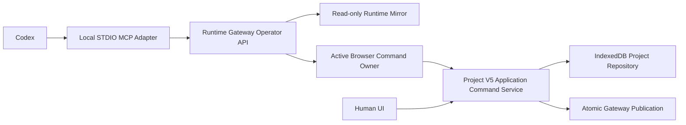

# Codex-Friendly OpenDigitalTwin Application Design

**Date:** 2026-07-28
**Status:** Approved design
**Target:** Project V5 OpenDigitalTwin / RobotSimWeb
**Scope:** Repository-friendly development plus safe operation of the running Digital Twin

## 1. Purpose

OpenDigitalTwin should be usable by Codex as both:

1. a software repository that can be understood, changed, tested, and reviewed reliably; and
2. a running engineering application whose Project, Scene, Robot, Job, and Runtime state can be inspected and safely operated without guessing browser pixel coordinates.

The target is not an embedded AI chat interface. The target is a deterministic control contract shared by the human UI and Codex.

## 2. Official Codex Guidance Applied

This design follows the separation recommended by the official Codex documentation:

- [`AGENTS.md`](https://learn.chatgpt.com/docs/agent-configuration/agents-md) provides concise, persistent repository guidance.
- [Skills](https://learn.chatgpt.com/docs/build-skills) package repeatable project workflows using progressive disclosure.
- [Model Context Protocol](https://learn.chatgpt.com/docs/extend/mcp) connects Codex to tools and runtime context.
- [Hooks](https://learn.chatgpt.com/docs/hooks) provide optional mechanical checks, not application transaction logic.
- [`codex exec`](https://learn.chatgpt.com/docs/non-interactive-mode) supports deterministic CI and machine-readable verification.

These mechanisms are complementary. `AGENTS.md` defines behavior, Skills define workflows, MCP exposes runtime capabilities, and deterministic commands provide evidence.

## 3. Current Foundation

The existing Project V5 architecture already provides important prerequisites:

- revision-qualified, serialized Project mutation in `src/features/project/v5/project-v5-mutation-service.ts`;
- structured Project errors with code, path, message, and recovery information in `src/core/project-v5/errors.ts`;
- bounded Gateway error envelopes in `src/core/runtime-protocol/gateway-error-envelope-v1.ts`;
- Runtime Gateway health, readiness, status, diagnostics, command lease, Project publication, and runtime command routes in `middleware/runtime-gateway/main.ts`;
- browser publisher ownership and lease fencing;
- stable runtime command identifiers and idempotency behavior;
- pinned Node.js and npm versions, targeted tests, full verification, and Playwright acceptance tests in `package.json`.

The principal gaps are:

- no repository or nested `AGENTS.md`;
- empty project `.codex` and `.agents` capability surfaces;
- no Codex-facing MCP tool facade;
- no shared Project V5 application command authority used by both the UI and external operators;
- no generated machine-readable Project, Runtime, and MCP schemas;
- no agent-oriented diagnostic bundle;
- no single-command developer stack, deterministic reset, or Codex verification report.

## 4. Selected Product Boundary

Three possible boundaries were considered:

### A. Repository Friendly

Codex can safely change code, tests, and documentation, but cannot operate the running Digital Twin.

### B. Repository and Runtime Operator

Codex can develop the repository and inspect or operate a running simulation through explicit MCP tools.

### C. Embedded Assistant

The application embeds an end-user AI chat experience and model runtime.

**Decision:** Use boundary B.

Boundary B provides engineering value without adding an in-product chat system, end-user model billing, prompt storage, or remote-agent security surface.

## 5. Safety Boundary

Codex may:

- inspect Project, Scene, Robot, Job, binding, and Runtime state;
- validate Project changes without applying them;
- apply approved Simulation Project changes through the active Browser Command Owner;
- start, cancel, reset, and observe Simulation Jobs;
- run predefined repository and application verification.

Codex may not, through the initial operator contract:

- write to an external OPC UA Server;
- command a physical PLC, Robot, drive, or machine;
- transfer or deploy controller code;
- infer that a simulation result establishes machinery safety;
- bypass revision, ownership, preview, or approval checks.

Any future external write capability must use separate MCP tools, explicit side-effect annotations, and explicit approval. Simulation-write tools must never silently perform external writes.

## 6. Architecture



### 6.1 Project authority

The browser remains the authoritative Project owner.

The Runtime Gateway must not independently mutate or persist the Project. It mirrors the active published revision and forwards mutation requests to the active Browser Command Owner.

If no Browser Command Owner is available:

- read-only tools may return the last active Gateway mirror with its exact revision and freshness;
- Project mutation tools fail with `BROWSER_COMMAND_OWNER_UNAVAILABLE`;
- no fallback ownership transfer or hidden Project write occurs.

### 6.2 Shared command authority

The human UI and MCP operator path must use the same Project V5 Application Command Service.

React event handlers, MCP handlers, and Gateway routes must not implement duplicate business rules. Adapters may translate inputs and outputs, but validation, revision checks, mutation, persistence, and publication remain in the shared application service.

### 6.3 MCP topology

The first implementation uses a project-local STDIO MCP adapter:

```text
Codex host
  -> project-scoped STDIO MCP process
  -> local Runtime Gateway Operator HTTP API
```

Reasons:

- project-scoped setup through trusted `.codex/config.toml`;
- no public MCP endpoint or authentication system required;
- direct reuse of the local Runtime Gateway;
- straightforward inspection with MCP tooling;
- separation of MCP protocol concerns from the core Gateway.

A Streamable HTTP MCP endpoint is a later deployment option, not part of this design.

## 7. MCP Tool Contract

The initial tool surface is deliberately small.

### 7.1 Read-only tools

| Tool | Responsibility |
| --- | --- |
| `project_get_summary` | Return active Project identity, revision, counts, validation state, and warnings. |
| `scene_list_entities` | List Frames, Objects, and Robots using stable IDs, type, parent, ownership, and visibility. |
| `entity_get` | Return one entity's transform, parent, status, ownership, and OPC UA binding summary. |
| `robot_get_definition` | Return Joint chain, origins, axes, limits, TCP, geometry references, and provenance. |
| `job_get` | Return Job steps, speed, Actions, ownership, and runtime state. |
| `runtime_get_diagnostics` | Return Browser owner, Gateway, OPC UA endpoint, subscription, mapping, quality, and error state. |
| `project_validate` | Run Project validation without changing Project or Runtime state. |
| `simulation_get_result` | Return the state and result of a previously issued Simulation command. |

Read-only tools:

- do not save, connect, disconnect, restart, renew ownership, or publish;
- do not change Project revision or Runtime epoch;
- return bounded, structured data;
- use pagination and filters for list responses;
- identify entities by stable ID, never only by display name or list position.

### 7.2 Project mutation tools

| Tool | Responsibility |
| --- | --- |
| `project_preview_change` | Validate a closed set of Project Commands and return a non-mutating preview. |
| `project_apply_change` | Apply one valid, unexpired preview atomically. |

The Project mutation surface must not expose raw JSON Patch or direct `PUT /runtime/project`.

The closed Project Command union initially contains:

```text
SetEntityTransform
SetEntityVisibility
CreatePrimitive
DeleteEntity
SetEntityGroup
UpdateOpcUaBinding
UpdateRobotBase
UpdateRobotMechanics
CreateJob
UpdateJobStep
ReorderJobStep
DeleteJobStep
```

Commands not present in the union are rejected before preview.

### 7.3 Preview and apply

`project_preview_change` input:

```text
expectedRevisionId
commands[]
```

It returns:

```text
previewId
projectId
baseRevisionId
proposedRevisionId
normalizedCommands
affectedEntities
warnings
validationResult
expiresAt
```

The preview:

- does not write IndexedDB;
- does not publish to the Gateway;
- does not change UI state;
- expires five minutes after creation;
- is invalidated if the active Project revision changes.

`project_apply_change` input:

```text
previewId
expectedRevisionId
idempotencyKey
```

It returns:

```text
projectId
previousRevisionId
revisionId
runtimeEpoch
correlationId
publicationStatus
```

Application semantics:

- the exact normalized preview is applied;
- validation is repeated before commit;
- persistence and Gateway publication follow the existing atomic mutation boundary;
- a stale revision fails with `PROJECT_REVISION_CONFLICT`;
- an expired preview fails with `PROJECT_PREVIEW_EXPIRED`;
- reuse of an idempotency key with the same request returns the original result;
- reuse of an idempotency key with different input fails with `COMMAND_ID_CONFLICT`;
- a failed apply leaves browser storage, UI, and Gateway at the prior revision.

### 7.4 Simulation runtime tool

`simulation_execute` accepts a closed action union:

```text
StartJob
CancelJob
ResetSimulation
```

It requires:

```text
projectId
revisionId
commandId
action
```

The tool returns acknowledgement and a correlation ID. Execution progress and final state are obtained with `simulation_get_result`.

The initial `simulation_execute` contract contains no external OPC UA write action.

## 8. Tool Permission Classes

Tools use three conceptual permission classes.

### READ

Pure inspection and validation. No hidden mutation or external interaction.

### SIMULATION_WRITE

Project edits and Simulation runtime actions. These tools are marked as state-changing and use preview or explicit write approval.

### EXTERNAL_WRITE

External OPC UA writes and physical-system actions. These tools are not included in the initial MCP server. If introduced later, they must be separate tools and always require explicit approval.

MCP server instructions must state the authority boundary and recovery workflow in the first 512 characters so Codex can evaluate the server safely before choosing a tool.

## 9. Common Result Contract

Every successful result includes, where applicable:

```text
projectId
revisionId
runtimeEpoch
correlationId
observedAt
freshness
```

Every failure uses a common envelope:

```json
{
  "status": "failed",
  "code": "PROJECT_REVISION_CONFLICT",
  "message": "The active Project revision changed after preview.",
  "path": "$.expectedRevisionId",
  "correlationId": "cmd-example",
  "expectedRevisionId": "rev-a",
  "actualRevisionId": "rev-b",
  "recoveryActions": [
    "Call project_get_summary.",
    "Create a new preview against the active revision."
  ]
}
```

Error codes are stable machine-readable identifiers. Messages may improve without changing the code. Recovery actions are bounded imperative strings, not executable commands.

## 10. Diagnostic Model

The UI `Copy Diagnostic Bundle` action and `runtime_get_diagnostics` tool use one shared diagnostic model.

```text
diagnostics-v1
├─ application
│  ├─ version
│  ├─ build
│  └─ environment
├─ project
│  ├─ projectId
│  ├─ revisionId
│  ├─ validation
│  └─ asset warnings
├─ commandOwner
│  ├─ browserPublisherId
│  ├─ leaseGeneration
│  └─ leaseExpiry
├─ gateway
│  ├─ runtimeEpoch
│  ├─ readiness
│  └─ lastError
├─ opcua
│  ├─ endpoint phases
│  ├─ subscriptions
│  ├─ mapping quality
│  └─ retry state
├─ commands
│  └─ recent bounded event history
└─ verification
   └─ latest deterministic check result
```

The event history retains at most 200 entries. Each entry carries a correlation ID and bounded fields sufficient to trace:

```text
MCP request
  -> Gateway operator request
  -> Browser command
  -> Project mutation
  -> Gateway publication
  -> Runtime result
```

Diagnostics exclude:

- OPC UA passwords;
- certificate private keys;
- OpenAI API keys;
- arbitrary environment variables;
- full STEP or GLB binaries;
- full Project source documents;
- unrelated local absolute paths.

## 11. Repository Guidance

### 11.1 AGENTS.md hierarchy

```text
RobotSimWeb/
├─ AGENTS.md
├─ src/core/project-v5/AGENTS.md
├─ middleware/runtime-gateway/AGENTS.md
└─ tests/AGENTS.md
```

The root file stays concise and defines:

- Project V5 as the active system;
- the architecture and Source of Truth map;
- supported install, development, build, and verification commands;
- revision and atomic publication rules;
- OPC UA and external-equipment safety boundaries;
- deterministic STEP and Robot Mechanics rules;
- the completion and evidence standard;
- the rule that Legacy features remain removed until the user explicitly requests them.

Nested guidance defines only local rules:

- `src/core/project-v5/AGENTS.md`: closed records, revision identity, validation, and stable errors;
- `middleware/runtime-gateway/AGENTS.md`: browser ownership, lease fencing, bounded protocols, and OPC UA lifecycle;
- `tests/AGENTS.md`: targeted verification, semantic selectors, runtime acceptance, and no false-positive success assertions.

### 11.2 Project Skills

```text
.agents/skills/
├─ robot-asset-onboarding/
│  ├─ SKILL.md
│  ├─ scripts/
│  └─ references/
├─ opcua-runtime-diagnostics/
│  ├─ SKILL.md
│  └─ scripts/
└─ release-verification/
   ├─ SKILL.md
   ├─ scripts/
   └─ templates/
```

#### robot-asset-onboarding

- inspect STEP sources and geometry statistics;
- validate Robot Geometry and Joint/Link mapping;
- generate preview and acceptance evidence;
- never infer Joint topology automatically from fused STEP geometry.

#### opcua-runtime-diagnostics

- verify Gateway startup and readiness;
- verify active Project revision and Browser publisher lease;
- inspect endpoint connection, subscriptions, mapping quality, and errors;
- provide bounded recovery guidance without changing persisted Project ownership.

#### release-verification

- classify the changed scope;
- select the required targeted tests;
- run lint, build, Gateway configuration, runtime smoke, and E2E checks;
- emit a concise machine-readable verification summary.

Each Skill owns one repeatable workflow. Large architecture documentation remains in referenced files and is loaded only when required.

## 12. Deterministic Commands

The repository adds these stable entry points:

```text
npm run dev:stack
npm run demo:reset
npm run --silent verify:codex -- --scope <scope> --json
npm run diagnostics:bundle -- --sanitize
npm run mcp:smoke
```

### dev:stack

Starts the web application and Runtime Gateway with readiness checks. It must fail clearly when a required process or port is unavailable.

### demo:reset

Restores a named deterministic sample Project and Simulation state without changing external OPC UA systems.

### verify:codex

Runs a closed verification profile and emits both human-readable progress and a JSON result:

```json
{
  "status": "passed",
  "scope": "project-v5",
  "checks": [
    { "id": "lint", "status": "passed" },
    { "id": "unit", "status": "passed", "tests": 312 },
    { "id": "gateway-build", "status": "passed" },
    { "id": "browser-e2e", "status": "passed", "tests": 4 }
  ],
  "warnings": [],
  "artifacts": []
}
```

The command exits with code `0` only when all required checks pass.

### diagnostics:bundle

Exports the shared sanitized diagnostic contract. It must not include credentials, CAD binaries, or arbitrary local environment data.

### mcp:smoke

Starts the project MCP adapter, discovers the expected tool catalog, calls a read-only tool, and verifies the response schema.

## 13. Hooks Policy

Project Hooks are not required for the first implementation.

After manual commands and Skills are stable, optional Hooks may:

- warn at `Stop` when changed source lacks verification evidence;
- inspect tool use for secret exposure or forbidden external OPC UA writes;
- collect already-produced structured verification results.

Hooks must not:

- mutate the Project;
- publish to the Runtime Gateway;
- start or stop Jobs;
- connect or disconnect OPC UA endpoints;
- replace the Application Command Service.

This restriction avoids putting critical transaction logic in concurrently executed, separately trusted lifecycle scripts.

## 14. Verification Strategy

### 14.1 Contract tests

Verify:

- exact MCP input and output schemas;
- stable error codes;
- bounded text, arrays, and diagnostic history;
- tool annotations and permission classes;
- rejection of unsupported Project Commands.

### 14.2 Command parity tests

Prove that the UI and MCP adapters call the same Project V5 Application Command Service and receive equivalent normalized results.

### 14.3 Mutation safety tests

Cover:

- stale revision;
- preview expiration;
- same-request idempotent retry;
- conflicting idempotency reuse;
- Browser Command Owner absence;
- persistence failure;
- Gateway publication failure;
- rollback preserving the previous browser and Gateway revision.

### 14.4 Runtime acceptance

Run the actual web application and Runtime Gateway, then:

1. discover MCP tools;
2. read Project summary;
3. list Scene entities;
4. preview an Object transform change;
5. verify that preview changed no state;
6. apply the preview;
7. observe the same revision in UI, browser storage, and Gateway;
8. start a Simulation Job;
9. observe the final Job result;
10. retrieve a sanitized diagnostic bundle.

### 14.5 OPC UA boundary test

Prove that Project and Simulation tools do not perform an external OPC UA write. External writes remain absent from the initial MCP catalog.

## 15. Acceptance Criteria

The design is implemented successfully when all of the following are true:

1. A trusted project configuration lets Codex discover and start the local MCP Server.
2. Codex can inspect Project, Scene, Robot, Job, binding, and OPC UA runtime state without browser pixel interaction.
3. Every read-only tool leaves Project revision and Runtime epoch unchanged.
4. `project_preview_change` leaves UI, IndexedDB, Gateway, and Runtime unchanged.
5. Applying one valid preview changes Project revision exactly once.
6. Applying the same request again with the same idempotency key does not create a duplicate change.
7. A stale revision fails with `PROJECT_REVISION_CONFLICT`.
8. An expired preview fails with `PROJECT_PREVIEW_EXPIRED`.
9. A missing Browser Command Owner fails without changing Project state.
10. A successful Project mutation produces the same revision in the UI, browser repository, and Gateway.
11. Codex can start, cancel, reset, and observe Simulation execution through explicit tools.
12. Simulation tools cannot issue an external OPC UA write.
13. All failures include a stable code, path where applicable, correlation ID, and bounded recovery actions.
14. A Diagnostic Bundle reconstructs the path from MCP request through Runtime result.
15. Diagnostic output contains no credentials or CAD binaries.
16. `npm run --silent verify:codex -- --scope <scope> --json` returns a valid JSON report and exit code `0` only when all required checks pass.
17. Root and nested `AGENTS.md` files route Codex to the correct Source of Truth and verification commands.
18. Existing `npm run verify` checks and the new MCP runtime acceptance suite pass.

## 16. Explicit Exclusions

This design does not include:

- an embedded AI chat UI;
- remote public MCP hosting or authentication;
- autonomous external OPC UA or PLC writes;
- PLC deployment, transfer, or controller lifecycle actions;
- AI-based STEP Joint inference;
- physical collision, dynamic simulation, or machinery safety validation;
- manufacturer-specific Robot program generation;
- Hook-driven Project mutation;
- multi-agent orchestration as an application feature.

## 17. Delivery Slices

The design should be delivered in four bounded slices:

1. **Repository guidance and deterministic commands**
   - root and nested `AGENTS.md`;
   - Project Skills;
   - `dev:stack`, `demo:reset`, and `verify:codex`.

2. **Shared Project V5 command authority**
   - closed Project Command union;
   - preview registry;
   - shared UI and operator application service.

3. **Gateway Operator API and local MCP adapter**
   - read-only tools first;
   - preview/apply second;
   - Simulation commands third.

4. **Diagnostics and runtime acceptance**
   - shared diagnostic store and bundle;
   - schema generation;
   - MCP smoke and end-to-end acceptance;
   - optional Hooks only after the preceding workflow is stable.

Each slice must preserve the existing Project V5 revision and publication guarantees.
