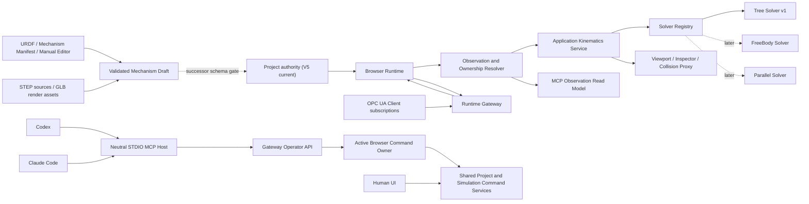

# Generalized OpenDigitalTwin Mechanism, Live State, and MCP Design

**Status:** Approved for implementation planning

**Date:** 2026-07-29

**Project envelope:** Project V5 remains the active source of truth

**First implementation slice:** Mechanism Core plus deterministic branched Tree forward kinematics

## 1. Purpose

OpenDigitalTwin currently provides a strong browser-owned Project V5 model, deterministic serial Robot forward kinematics, Jobs, scene frames, OPC UA Client/Server/Bridge integration, runtime quality handling, and geometric visualization.

The next architecture must extend that foundation without turning every moving asset into a fixed six-axis Robot. It must support:

- conventional articulated Robots such as NED2;
- branched Humanoid mechanisms with several motion groups and end frames;
- CNC and other mixed prismatic/revolute machines;
- Robots mounted on linear axes or other moving parent frames;
- later FreeBody mechanisms such as Drones and AGVs;
- later closed-loop parallel mechanisms such as three-axis and four-axis Delta Robots;
- one neutral Model Context Protocol server that works with both Codex and Claude Code.

This design deliberately targets a lightweight live semantic and kinematic Digital Twin. It does not attempt to become a physics engine or a safety-rated Robot validation product.

## 2. Approved Decisions

The following decisions were approved during design review:

1. Use one common Mechanism Core with pluggable Solver adapters.
2. Keep Robot as a dedicated semantic capability instead of treating every Mechanism as a Robot.
3. Implement the Tree Kinematics Solver first.
4. Make deterministic forward kinematics mandatory and make inverse kinematics, Jacobians, and constraint projection optional Solver capabilities.
5. Separate Project configuration from ephemeral live observations.
6. Represent live values as `Actual`, `Commanded`, `Simulated`, or `Derived`.
7. Keep user-visible Recorder, Historian, historical Replay, and Session persistence out of scope while preserving bounded in-memory protocol catch-up needed for runtime correctness.
8. Use URDF, a native Mechanism Manifest, and a Manual Editor as authoring inputs.
9. Treat STEP as an engineering geometry source and GLB as the preferred web rendering derivative.
10. Never infer Joint semantics from STEP geometry in the approved deterministic workflow.
11. Preserve the simple Robot STEP import profile of one to seven STEP files, but do not equate file count with Joint count.
12. Use a shared local STDIO MCP Server for Codex and Claude Code first.
13. Add Streamable HTTP later for Docker and remote deployment.
14. Do not expose external OPC UA, PLC, or physical Robot writes through the initial MCP Server.
15. Preserve fail-closed Project, Revision, lease, ownership, and publication boundaries.

## 3. Current Foundation and Constraints

### 3.1 Project and runtime authority

Project V5 remains the durable design and configuration source of truth:

- Project persistence is Browser-owned.
- The Runtime Gateway mirrors a published Project Revision.
- The Gateway does not independently mutate or persist the Project.
- Project changes use Revision fencing and atomic publication.
- Browser command ownership is represented by a bounded lease.

Project V5 is a closed wire and persistence schema. This design does not add unvalidated root fields to schema version 5.

Relevant current areas include:

- `src/core/project-v5`
- `src/features/project/v5`
- `src/core/robot-runtime-v5`
- `src/features/runtime-gateway/v5`
- `middleware/runtime-gateway`

### 3.2 Current kinematic limit

`src/core/robot-runtime-v5/serial-kinematics.ts` currently requires an unbranched serial chain. It supports revolute and prismatic Joints, validates a complete Joint value record, and returns Link and Frame World poses.

This current implementation is valuable compatibility evidence, but it cannot represent a Humanoid, a branched machine, a free body, or a closed-loop Delta mechanism.

### 3.3 Existing MCP design work

The repository already contains a Codex-oriented design and two implementation plans:

- `docs/superpowers/specs/2026-07-28-codex-friendly-application-design.md`
- `docs/superpowers/plans/2026-07-28-project-v5-command-authority.md`
- `docs/superpowers/plans/2026-07-28-codex-mcp-operator.md`

Those documents remain useful foundations for Project command authority, preview/apply, Browser ownership, diagnostics, and MCP safety. They must not be executed unchanged:

- Codex-specific server and launcher naming must become client-neutral.
- Claude Code project configuration must be added.
- Robot-only tool contracts must be generalized to Mechanism and Solver contracts.
- Live Observation resources must be added.
- The initial STDIO Server must remain one implementation used by both clients.

No implemented MCP Server, Operator API, or MCP client configuration currently exists in the repository.

## 4. Scope

### 4.1 In scope

- a compositional Twin Entity and Mechanism domain model;
- dedicated Robot capability data;
- versioned Solver Registry and deterministic Kinematics Service;
- branched Tree forward kinematics;
- multiple motion groups and multiple end frames/TCPs;
- Parent Frame composition for mounted mechanisms;
- generic live Observation and value ownership contracts;
- coherent OPC UA pose, Joint, Signal, and Status ingestion;
- presentation-only interpolation;
- deterministic asset and Mechanism onboarding;
- a Codex/Claude-compatible STDIO MCP Server design;
- bounded Project mutation and Simulation commands through shared application authority;
- geometric and kinematic validation;
- failure isolation and machine-readable diagnostics.

### 4.2 Explicitly out of scope

- rigid-body dynamics;
- contact physics;
- force, torque, load, structural strength, or aerodynamics;
- safety-rated validation or physical safety certification;
- automatic AI-based Joint extraction from geometry;
- manufacturer-specific Robot program generation;
- Recorder, Historian, Replay, or Session storage;
- removal of bounded in-memory transport replay/catch-up used to recover the current live state;
- hidden Gateway Project persistence;
- public MCP hosting, OAuth, RBAC, and TLS in the first STDIO slice;
- external OPC UA/PLC/Robot writes through the initial MCP Server;
- a complete Asset Administration Shell server;
- restoring removed Legacy features.

## 5. Target Architecture



The architectural boundaries are:

- Project V5 owns current durable Robot/scene definitions and declared ownership; generalized Mechanism persistence waits for the successor-schema gate.
- Browser Runtime owns Simulation, Job execution, and active Project changes.
- Runtime Gateway is the external OPC UA and process boundary.
- Solver implementations perform pure kinematic calculation.
- Viewport and MCP are consumers of shared application services, not alternate authorities.

## 6. Common Domain Model

### 6.1 Composition

The model uses composition instead of one universal Robot record.

```text
Twin Entity
  + optional Mechanism Definition
  + zero or more typed Capabilities
  + one or more Runtime Instances
```

A passive fixture may be a Twin Entity with geometry and no Mechanism. A Robot is a Twin Entity with a Mechanism and a Robot Capability. A CNC may combine a Mechanism with Machine and Spindle capabilities.

### 6.2 Twin Entity

A Twin Entity carries stable identity and semantic metadata:

```text
entityId
displayName
manufacturer
model
definitionRevision
assetBindings[]
mechanismDefinitionId?
capabilities[]
```

Display names are not identities. Jobs, OPC UA mappings, MCP tools, and references use stable IDs.

### 6.3 Mechanism Definition

The common Mechanism Definition contains:

```text
mechanismId
topologyKind
solverRef
bodies[]
joints[]
frames[]
motionGroups[]
constraints[]
geometryBindings[]
sourceProvenance
```

`solverRef` includes a stable Solver key, contract version, and Solver parameters.

For Slice 1, Project V5 does not store that transient projection. Deterministic evaluation identity is therefore:

```text
projectId
projectRevisionId
configRevision
adapterKey
adapterVersion
solverKey
solverContractVersion
normalizedSolverParametersHash
```

Project V5 Revision alone does not fingerprint adapter or Solver implementation changes. Derived results and diagnostics carry this evaluation identity. A successor Project schema may persist `solverRef`, after which its config Revision fingerprints the stored Solver selection and parameters.

Each Body has a stable `bodyId`. Each Joint has:

```text
jointId
parentBodyId
childBodyId
jointType
origin
axis
limits
home
direction
zeroOffset
maximumVelocity
```

Tree Solver v1 supports `fixed`, `revolute`, and `prismatic`.

The canonical first-slice transform contract preserves current V5 semantics:

```text
qMechanical = direction * (qCommand + zeroOffset)
T_parent_to_child = T_origin * T_motion(qMechanical)
```

`zeroOffset` remains explicit. An adapter may not absorb it into another field unless equivalence and round-trip behavior are proven for limits, home, and representative commands.

Frames represent mount, base, flange, tool, TCP, work, sensor, and custom coordinate systems. Motion Groups declare a stable set of controlled coordinates and one or more end frames.

Constraints are present in the common model for future Parallel Solvers, but Tree Solver v1 rejects closed-loop constraints as unsupported.

### 6.4 Dedicated Robot Capability

Robot remains a dedicated semantic type. Robot Capability data includes:

```text
robotCapabilityId
mechanismId
motionGroupIds[]
baseFrameId
flangeFrameIds[]
toolFrameIds[]
tcpFrameIds[]
homeCoordinateSets[]
robotStatusSemantics
roboticsOpcUaView
```

The Robot Capability owns Robot-specific Job semantics, Joint and Robot Status views, flange/tool/TCP conventions, and OPC UA Robotics mapping.

Mechanism is therefore not a replacement for Robot semantics. It is the reusable kinematic substrate beneath Robot, Machine, Transport, and future capabilities.

### 6.5 Runtime Instance

A Runtime Instance contains:

```text
instanceId
definitionId
parentFrameId
localPose
activeToolFrameId?
activeTcpFrameId?
visibility
declaredValueOwners
```

Several Runtime Instances may reference the same Definition. This supports two identical Robots without duplicating geometry or mechanics.

Robot-on-Linear is modeled by Frame composition:

```text
World
  -> Linear Mechanism Instance
     -> moving carriage Frame
        -> Robot Mechanism Instance root
```

The Robot Solver does not need a special linear-motor mode.

### 6.6 Project V5 projection and schema evolution gate

Slice 1 keeps `WorkcellProjectV5` unchanged. It projects current V5 Robot Definition and Robot Instance records into normalized, transient `MechanismDefinitionV1` and Runtime Instance contracts at the application boundary:

```text
WorkcellProjectV5 Robot records
  -> V5-to-Mechanism adapter
  -> transient MechanismDefinitionV1
  -> shared Kinematics Service
```

Humanoid and CNC definitions in Slice 1 are checked-in Solver and viewport fixtures, not new Project V5 root records. Existing Robot Jobs, `jointSource`, and OPC UA Robot targets keep their current V5 semantics.

Native persistence of generalized Mechanisms, reusable Definitions/Instances, per-channel ownership, generic Mechanism Jobs, generic Mechanism OPC UA targets, GLB derivatives, or versioned external Asset locators requires a separately approved successor Project schema and a tested V5 migration. No new root field or changed limit is silently added to schema version 5, and no successor data is back-written as lossy V5.

## 7. Coordinate and Unit Rules

The Mechanism Core uses one canonical calculation representation:

- right-handed domain coordinates;
- Z-up World convention;
- positions in metres;
- revolute coordinates in radians;
- prismatic coordinates in metres;
- orientations as normalized quaternions;
- transforms as rigid homogeneous compositions.

UI and integration boundaries may use millimetres, degrees, RPY, or vendor-specific representations, but they must declare units and orientation convention explicitly.

Current Project V5 Robot Joint values use degree-oriented semantics. A versioned adapter converts current Robot Definition values to the canonical Solver representation and converts validated results back where required. Existing stored Projects are not silently reinterpreted.

Geometry source orientation is handled by an explicit source-to-domain adapter:

```text
sourceLengthUnit
sourceUpAxis
sourceForwardAxis
sourceHandedness
rootPreTransform
```

This adapter is stored as deterministic asset metadata. It solves a Robot being imported on its side without baking arbitrary corrections into Joint definitions.

## 8. Solver Contract

### 8.1 Common interface

Every Solver implements the same conceptual contract:

```ts
interface KinematicsSolverV1 {
  readonly solverKey: string
  readonly contractVersion: string
  describeCapabilities(): SolverCapabilitiesV1
  validateDefinition(definition: MechanismDefinitionV1): ValidationReportV1
  normalizeCoordinates(
    definition: MechanismDefinitionV1,
    coordinates: Readonly<Record<string, number>>,
  ): NormalizedCoordinatesV1
  evaluateForward(request: ForwardKinematicsRequestV1): ForwardKinematicsResultV1
  solveInverse?(request: InverseKinematicsRequestV1): InverseKinematicsResultV1
  evaluateJacobian?(request: JacobianRequestV1): JacobianResultV1
  projectConstraints?(request: ConstraintProjectionRequestV1): ConstraintProjectionResultV1
}
```

Required operations are capability discovery, validation, coordinate normalization, and forward evaluation.

Inverse kinematics, Jacobian evaluation, and constraint projection are optional. Unsupported operations fail with a stable `SOLVER_CAPABILITY_UNAVAILABLE` result. They never fall back to another Solver silently.

### 8.2 Forward request

A forward request contains only pure calculation inputs:

```text
mechanismDefinition
rootWorldPose
coordinatesByStableId
requestedFrameIds?
requestedMotionGroupId?
```

The Solver does not read time, Network state, OPC UA state, Browser stores, geometry files, or rendering objects.

Every forward request contains a complete coordinate value for every movable Joint. `requestedMotionGroupId` filters requested outputs only; it never permits a Solver to fill omitted coordinates from home or another hidden default. UI, Job, OPC UA, or MCP partial commands are merged with the current resolved full coordinate set and validated by the Application Kinematics Service before Solver invocation.

### 8.3 Forward result

The canonical result contains:

```text
solverKey
solverContractVersion
normalizedCoordinates
bodyLocalPoses
bodyWorldPoses
frameWorldPoses
motionGroupEndFramePoses
warnings[]
```

Maps are canonicalized by stable ID. Values are finite and immutable. The same normalized Definition, coordinates, root pose, and Solver version produce the same result.

### 8.4 Application Kinematics Service

Viewport, Inspector, Job Executor, collision proxy generation, OPC UA mapping, and MCP call one Application Kinematics Service.

This service:

1. resolves the exact Mechanism Definition and Solver version;
2. resolves the active coordinate layer outside the Solver;
3. converts units to canonical SI;
4. invokes the Solver;
5. validates and canonicalizes the result;
6. publishes Derived observations and consumer-specific views.

No React handler, MCP handler, or OPC UA adapter may implement a separate FK algorithm.

## 9. Tree Kinematics Solver v1

Tree Solver v1 generalizes the existing serial implementation.

### 9.1 Valid topology

- exactly one root Body;
- connected and acyclic;
- each non-root Body has exactly one parent Joint;
- a parent Body may have several child Joints;
- stable Body and Joint IDs are unique;
- fixed, revolute, and prismatic Joints are supported;
- Frames may attach to Bodies or other valid Frames without cycles.

Joint array position does not determine topology. The Solver uses a deterministic topological traversal and stable ID ordering for ties.

### 9.2 Supported first-slice examples

- NED2 or another ordinary six-axis Robot;
- a branched Humanoid fixture with independent arm, leg, and head groups;
- a CNC fixture with three prismatic axes and a spindle Frame;
- a Robot whose base Frame is parented to a moving linear carriage Frame;
- two Runtime Instances of one Robot Definition.

### 9.3 Current compatibility

The current unbranched serial Robot Definition is a valid Tree with one outgoing movable branch per Body. Compatibility tests compare current and new FK results at representative home, mid-range, and limit-adjacent poses.

Current Robot-specific errors remain mapped to stable compatibility codes where externally consumed. New common Solver errors include:

- `SOLVER_UNAVAILABLE`
- `SOLVER_CAPABILITY_UNAVAILABLE`
- `TOPOLOGY_UNSUPPORTED`
- `MECHANISM_TOPOLOGY_INVALID`
- `COORDINATE_SET_MISMATCH`
- `COORDINATE_VALUE_NOT_FINITE`
- `JOINT_LIMIT_EXCEEDED`
- `FRAME_NOT_FOUND`
- `CONSTRAINT_UNSATISFIED`

### 9.4 Compatibility limits versus Mechanism budgets

The existing `MAX_ROBOT_JOINTS_V5` and `MAX_ROBOT_LINKS_V5` constants remain compatibility limits for the current Robot definition and profile during migration. They are not reinterpreted globally as limits for every Mechanism.

Mechanism Core introduces separately named, explicitly validated resource budgets that support at least the approved 64-active-Joint and 128-Body performance fixture. Raising, removing, or changing the stored semantics of an existing Robot limit requires a separate schema decision, compatibility tests, and migration evidence. A vendor or Capability profile may impose a narrower limit without narrowing the common Mechanism contract.

## 10. Future Solver Families

### 10.1 FreeBody Solver

FreeBody Solver represents a body or root frame with independent translation and orientation coordinates. It supports later Drone, AGV, and independent mover use cases without creating an artificial six-Joint Robot chain.

Dynamics, thrust, aerodynamics, contact, and trajectory control remain out of scope.

### 10.2 Parallel Kinematics Solver

Parallel Solver represents actuated and passive Joints connected by closed-loop constraints. It supports later three-axis and four-axis Delta Robots.

The common Mechanism schema already reserves versioned constraints. The first implementation does not claim Delta support until constraint validation and forward solution fixtures pass.

## 11. Live Observation Model

### 11.1 Project Plane and Observation Plane

Project Plane is durable configuration:

- entity, Mechanism, Frame, Job, and Binding definitions;
- Manual baseline pose and status;
- declared owner for each dynamic semantic channel;
- Project Revision and `configRevision`.

In Slice 1, those Mechanism semantics are projected from existing Project V5 Robot records. The normalized Mechanism itself becomes durable only after the successor-schema gate.

Observation Plane is ephemeral runtime state:

- Actual, Commanded, Simulated, and Derived values;
- source, quality, status, and time evidence;
- sequence and Runtime Epoch;
- latest in-memory samples needed for current state and interpolation.

The Observation Plane does not write a user-visible Recorder, Historian, historical Replay log, or Session database. Existing bounded in-memory transport replay and catch-up windows remain allowed because they recover the current live state; they are not a user timeline and do not survive process lifetime.

### 11.2 Common Observation envelope

```text
channelId
entityId
semanticPath
layer: actual | commanded | simulated | derived
value
unit
frameId?
orientationConvention?
source.kind
source.id
quality
statusCode
sourceTimestamp
receivedTimestamp
publishedTimestamp
sequence
sequenceScope
coherenceGroupId?
sampleSetId?
projectRevisionId
configRevision
runtimeEpoch?
derivedFrom[]
```

Quality supports the existing `GOOD`, `UNCERTAIN`, `BAD`, and runtime `STALE` behavior. Status codes preserve source detail without allowing arbitrary unbounded messages.

### 11.3 Layer meaning

- `Actual`: externally observed or measured state, normally from OPC UA or another device adapter.
- `Commanded`: a requested target; it is not proof that the target was reached.
- `Simulated`: the current state advanced by local deterministic Simulation.
- `Derived`: state computed from other accepted observations, such as FK Frames.

Manual baseline values remain Project configuration. They are not misrepresented as live measurements.

### 11.4 Coherent ingestion

The ingest gate validates:

- Project and config Revision;
- type, unit, range, and finite values;
- sequence and source-time fences;
- complete coherence groups;
- declared Binding and owner.

XYZ and orientation fields are not mixed from different incomplete samples. Pose ownership is atomic at the transform/coherence-group level. Individual leaves may use separate source nodes only when they resolve to one declared owner and one accepted sample set. Observations preserve the coherence-group ID, sample-set ID, and sequence scope, and the ingest gate accepts or rejects the group atomically. RPY input declares its rotation convention and is converted to a quaternion at the Binding boundary.

### 11.5 Browser-to-Gateway current-state projection

The complete Observation read model is Browser-owned because Commanded, Simulated, and Derived values do not all exist in the Gateway today. A revision-fenced, bounded Browser-to-Gateway projection publishes the latest accepted observations needed by MCP and diagnostics:

```text
projectId
projectRevisionId
configRevision
runtimeEpoch
leaseGeneration
projectionSequence
observations[]
publishedAt
```

The Gateway validates the active Project/config Revision, lease generation, monotonic projection sequence, batch bounds, and each Observation envelope. It retains only the latest current-state projection plus the existing bounded transport catch-up window.

When no Browser owner exists:

- Gateway-native OPC UA Actual observations may remain available with their own source and freshness evidence;
- the last Browser-projected Commanded, Simulated, or Derived observations are explicitly `STALE`;
- `runtimeEpoch` and `leaseGeneration` are nullable when the Gateway has never accepted a Browser projection;
- a read never implies that a stale mirror is live Browser state.

## 12. Ownership and Resolution

Value ownership is field-scoped. Transform, Joint, Status, and Signal channels may have different owners.

Supported first-slice owner modes are:

- `manual`
- `simulation`
- `opcua:<endpointId>`

Resolution rules are:

1. Manual ownership resolves to the Project baseline and permits Inspector editing.
2. Simulation ownership resolves to the Simulated layer; Job and Jog create validated Commanded values.
3. OPC UA ownership resolves to the Actual layer and makes conflicting Manual editing read-only.
4. A Binding and its ownership transition are applied as one validated Project change.
5. A disconnected OPC UA owner does not silently fall back to Manual or Simulation.
6. The last valid value may remain visible with `STALE` or `BAD` quality.

For simulation-owned channels, the deterministic Simulation engine consumes accepted Commanded values and publishes Simulated observations. Job completion, FK, and downstream Derived values use accepted Simulated state, never Commanded state alone.

The current V5 Robot adapter maps one Robot `jointSource` to the complete Robot Joint group. Per-Joint or per-coordinate ownership is a successor-schema feature and is not emulated by splitting current V5 state.

The following ownership concepts remain separate:

- durable Project authority;
- runtime value owner;
- active Browser command lease;
- spatial parent or Attach owner;
- domain-specific Part or Shared Zone owner.

One generic `owner` field must not be reused for all of them.

## 13. Presentation Interpolation

Raw observations are never overwritten by smoothing.

Presentation sampling uses a small bounded in-memory buffer:

- limited Joint and position values use linear interpolation;
- continuous-angle handling is explicit per Joint;
- orientation uses shortest-path quaternion interpolation;
- discrete Status and Signal values use step/hold behavior;
- extrapolation is disabled by default;
- `STALE` or `BAD` stops forward presentation and retains the last value with visible quality.

Job completion, validation, diagnostics, and MCP reads use raw accepted observations by default. MCP may request `view: "presentation"` explicitly when a visualized value is needed.

## 14. Asset and Mechanism Onboarding

### 14.1 Authoring inputs

Three deterministic authoring inputs are supported:

1. **URDF Adapter**
   - imports Link, Joint, origin, axis, limit, and visual references;
   - produces a Mechanism Draft;
   - requires explicit supplementation for Robot capability, industrial status, and motion groups.

2. **Mechanism Manifest V1**
   - is the complete OpenDigitalTwin exchange format;
   - contains stable IDs, Solver reference, Bodies, Joints, Frames, Motion Groups, Capabilities, Constraints, Asset references, and provenance.

3. **Manual Editor**
   - maps geometry occurrences to Bodies;
   - edits Joint pivot, axis, type, limits, direction, home, and velocity;
   - edits Frames, TCPs, Motion Groups, and Capabilities;
   - presents deterministic source-axis and unit correction.

### 14.2 Geometry and topology separation

STEP and GLB do not define Joint semantics.

```text
Asset geometry occurrence
  -> GeometryOccurrenceBinding
     -> Mechanism Body
```

`GeometryOccurrenceBinding` records:

```text
assetId
occurrenceKey
bodyId
bodyFromGeometry
```

A single assembly STEP may expose many occurrences. The user assigns occurrences to Bodies and defines Joint relationships. No Joint is inferred merely from STEP hierarchy, part boundaries, round geometry, or file count.

### 14.3 Import profiles

**Simple Robot STEP Import**

- accepts one to seven STEP files as previously required;
- file count does not determine Joint count;
- one assembly STEP may back several Bodies;
- remains a bounded onboarding path for common industrial Robots.

**Advanced Mechanism Import**

- uses a Mechanism Manifest or URDF;
- supports Humanoid, CNC, and later complex mechanisms;
- references one or more assets subject to an explicit resource budget rather than the simple Robot file-count rule.

**Scene Object Import**

- accepts one STEP file per imported Object Entity;
- several Objects use separate asset references.

### 14.4 Asset references

Current Project V5 accepts its existing `asset://` and `builtin://` STEP references only. Slice 1 preserves that contract.

The successor generalized Project schema uses a versioned Asset locator. Project-relative Asset locators are preferred, and future Asset records include:

```text
assetUri
contentHash
sourceMetadata
sourceCoordinateAdapter
conversionSettings
renderDerivativeUri
provenance
```

Absolute local paths are allowed only as explicitly non-portable locators. Reopening requires Browser permission or Relink, and a content-hash mismatch is visible. GLB derivatives and external path locators remain authoring Draft metadata until the successor schema is approved; they are not inserted into current V5 records. The Project does not always embed full external STEP binaries.

### 14.5 Performance preflight

The previously removed 25 MiB and 150,000-triangle rejection thresholds are not restored as the primary acceptance policy. Existing V5 byte and triangle guards remain compatibility and browser-safety boundaries until an explicit migration replaces them; this design does not silently reinterpret or remove those constants.

A Worker preflight reports:

- file bytes;
- assembly occurrence count;
- face and tessellation complexity;
- triangle and vertex count;
- material count;
- estimated CPU and GPU memory.

The user chooses a stored conversion preset such as Preview, Balanced, or Full. The advanced pipeline makes preflight evidence and named resource budgets the normal user-facing decision path. A final browser-safety guard remains to prevent a tab crash. Any change to current V5 guards is versioned and verified rather than applied implicitly. Import and conversion are cancellable.

### 14.6 Validation gates

Before publication, the onboarding pipeline validates:

- stable IDs and references;
- topology, root, connectivity, cycles, and Solver support;
- finite Joint origins, axes, limits, home, direction, and maximum velocity;
- Geometry occurrence coverage and duplicates;
- Frame parents and Frame cycles;
- Motion Group and Capability consistency;
- zero-pose FK and representative coordinate values;
- finite Body and Frame output poses;
- asset reference and content-hash evidence.

Invalid input remains a Draft and never partially publishes to the active Project. Generalized Mechanism Drafts cannot publish into current V5 records; native publication remains unavailable until the successor schema is approved.

## 15. Codex and Claude MCP Design

### 15.1 Compatibility baseline

The implementation targets the stable MCP revision available when the implementation plan is written, with the currently verified baseline being MCP `2025-11-25`.

The official MCP specification defines STDIO and Streamable HTTP as standard transports. Codex and Claude Code both support a local STDIO Server and a remote HTTP Server:

- [Codex MCP documentation](https://developers.openai.com/codex/mcp/)
- [Claude Code MCP documentation](https://code.claude.com/docs/en/mcp)
- [MCP transport specification](https://modelcontextprotocol.io/specification/2025-11-25/basic/transports)

The first implementation uses one neutral STDIO Server:

```text
Codex .codex/config.toml ─┐
                          ├─> OpenDigitalTwin STDIO MCP Server
Claude .mcp.json ─────────┘
```

The Server implementation, Tool schemas, and results are identical. Only client configuration differs.

Streamable HTTP is a later Docker and remote-deployment transport over the same handler core. Deprecated HTTP+SSE, WebSocket, Claude-only channels, Codex-only execution features, sampling, and elicitation are not required for any core workflow.

### 15.2 MCP process boundary

```text
Codex or Claude
  -> project-local STDIO MCP process
  -> Runtime Gateway Operator API
  -> Active Browser Command Owner
  -> shared Project and Simulation command services
```

The MCP process:

- does not read or write Browser IndexedDB directly;
- does not call `PUT /runtime/project` as a Project edit API;
- does not call an external OPC UA write route;
- does not take Project ownership when the Browser owner is missing;
- writes only valid MCP protocol messages to stdout;
- writes logs to stderr.

In the STDIO slice, the Operator API binds to loopback only and requires a per-runtime unguessable capability credential supplied to the local MCP process without printing it. Mutating Tools additionally require an active Browser-enabled operator session and its current command lease. Read-only mirror access never grants mutation authority. No host-bound or unauthenticated Operator mutation route is permitted.

### 15.3 Resources

Resources are optional contextual conveniences and have equivalent Tool queries:

Concrete Resources:

```text
odt://project/current
odt://runtime/observations
odt://diagnostics/opcua
```

Resource Templates:

```text
odt://project/{projectId}
odt://entity/{entityId}
odt://mechanism/{mechanismId}
odt://job/{jobId}
odt://schema/{schemaName}
```

`resources/list` and `resources/templates/list` are paginated. Each `resources/read` response is independently hard-bounded and uses stable IDs; pagination is not invented inside a Resource read contract. STEP and GLB binaries are returned as references and metadata rather than embedded in model context.

Core workflows do not require resource subscriptions because host support and live-context behavior may differ. Explicit snapshot Tools remain the portable contract.

### 15.4 Initial Tools

Read and validate:

| Tool | Responsibility |
| --- | --- |
| `project_get_summary` | Active Project, Revision, counts, validation, and warnings. |
| `twin_list_entities` | Bounded stable-ID Entity list with filters and pagination. |
| `entity_get` | Definition, placement, ownership, binding, and current state summary. |
| `mechanism_get_definition` | Bodies, Joints, Frames, Groups, Solver, Capabilities, and provenance. |
| `solver_list_capabilities` | Available and planned Solver capabilities. |
| `kinematics_evaluate_fk` | Pure FK preview through the shared Kinematics Service. |
| `robot_get_profile` | Robot-specific groups, Frames, TCPs, home, and OPC UA Robotics view. |
| `job_get` | Job definition, steps, ownership, and runtime state. |
| `runtime_get_observations` | Bounded raw Observation snapshot; presentation view only when requested. |
| `runtime_get_diagnostics` | Browser owner, Gateway, OPC UA, mapping, quality, and failure state. |
| `mechanism_validate` | Non-mutating Mechanism validation. |
| `project_validate` | Non-mutating Project validation. |
| `simulation_get_result` | Status and result of a prior Simulation command. |

Bounded state changes:

| Tool | Responsibility |
| --- | --- |
| `project_preview_change` | Normalize and validate a closed Project Command set without mutation. |
| `project_apply_change` | Apply one valid unexpired preview atomically. |
| `simulation_execute` | Start Job, cancel Job, or reset Simulation. |

External OPC UA, PLC, or Robot writes are absent.

`simulation_execute` uses a closed initial MCP Simulation policy. Before `start-job`, it statically validates the selected Job and rejects `set-do` or any current/future action classified as an external effect with `SIMULATION_EXTERNAL_WRITE_NOT_ALLOWED`. The MCP path cannot bypass this check by delegating to the normal Job executor. A future explicitly sandboxed signal sink requires separate design approval.

Tool annotations use the standard MCP hints:

- read, validation, and pure FK Tools declare `readOnlyHint: true`;
- `project_apply_change` and `simulation_execute` declare `readOnlyHint: false`, `destructiveHint: true`, and `idempotentHint: true`;
- Tool annotations are advisory hints for clients and never replace server-side Revision, idempotency, ownership, lease, or command validation;
- client-specific `_meta` fields are not required for a core workflow.

The first implementation declares `execution.taskSupport: "forbidden"` for every Tool. Long-running Simulation uses `simulation_execute -> commandId -> simulation_get_result` polling instead of MCP Tasks.

### 15.5 Optional Prompts

Prompts are user-selected workflow shortcuts only:

- `onboard_mechanism`
- `diagnose_opcua`
- `author_simulation_job`
- `review_mechanism`

Every workflow remains possible through Tools alone.

### 15.6 Schema and result portability

Tool names use stable ASCII `snake_case`. Every Tool declares explicit input and output JSON Schemas without a root-level schema combinator.

Each result provides:

- `structuredContent`;
- the same serialized JSON in a TextContent block for compatibility;
- bounded lists with cursor, filters, and limit;
- Project and runtime evidence.

`project` and `runtime` evidence are nullable when they do not apply. Pure Solver capability queries, schema reads, and detached Draft FK do not manufacture an active Project, Runtime Epoch, or lease. Each Tool has a specific output schema built on the common envelope and requires only the evidence that Tool can prove.

Project-bound success envelope example:

```json
{
  "schemaVersion": "odt.mcp.result.v1",
  "ok": true,
  "requestId": "request-id",
  "project": {
    "projectId": "project-id",
    "projectRevisionId": "revision-id",
    "configRevision": "sha256"
  },
  "runtime": {
    "runtimeEpoch": 1,
    "leaseGeneration": 1
  },
  "data": {},
  "warnings": [],
  "error": null,
  "nextCursor": null
}
```

An expected validation report is successful Tool execution: for example, `mechanism_validate` may return `ok: true` with `data.valid: false`. A Tool precondition or execution failure uses the same `structuredContent` envelope and JSON TextContent fallback with `ok: false`, a stable error object, and MCP `CallToolResult.isError: true`. Each Tool output schema accepts both its success result and its execution-failure envelope. Malformed JSON-RPC and unknown Tools use protocol errors rather than domain envelopes.

### 15.7 Preview, apply, and idempotency

Project mutation keeps the previously approved two-stage contract:

```text
project_preview_change
  -> previewId + normalized commands + validation + expiry + lease fence

project_apply_change
  -> exact preview + expected Revision + idempotency key
```

Project apply requires:

```text
projectId
expectedProjectRevisionId
expectedConfigRevision
idempotencyKey
```

Preview creation requires an active Browser command owner and records the Server-observed owner identity and lease generation. Apply requires that exact unexpired lease fence plus the exact Project/config Revisions. The client never supplies or invents lease values.

A stale Revision, changed lease, expired preview, or ownership conflict produces no side effect.

`simulation_execute` independently requires:

```text
projectId
expectedProjectRevisionId
expectedConfigRevision
idempotencyKey
ttlMs
```

`ttlMs` is bounded by the Server and the accepted expiry is returned. The command result includes a stable `commandId` and `requestId`; retries with the same valid idempotency key do not execute the command twice. `simulation_get_result` polls that identifier and cannot start work.

### 15.8 MCP instructions

Server instructions state the following constraints at the beginning:

```text
OpenDigitalTwin exposes Project V5 and its live Browser/Gateway runtime.
Read current context before changes. Never assume a revision, change ownership
implicitly, or issue external OPC UA, PLC, or Robot actions. Preview requires
an expected Project revision and a closed command set. Apply and Simulation
require the expected Project/config revisions and an idempotency key.
```

Codex and Claude Code can use Server instructions, but instructions are advisory and may be abbreviated by a host. Critical constraints are therefore repeated in every state-changing Tool description and enforced by the Server.

### 15.9 Project-local client configuration

The repository provides examples for `.codex/config.toml` and `.mcp.json` that launch the same project-local Server command. These files cannot grant their own trust:

- Codex requires the user to trust the Project before project-scoped configuration is loaded;
- Claude Code requires the user to approve the project/workspace MCP Server;
- installation guidance shows the exact command, arguments, working directory, environment variables, and read-only acceptance path;
- no checked-in configuration silently approves execution or broadens external-write authority.

A thin `CLAUDE.md` points to the shared repository policy and MCP usage guide instead of duplicating safety rules. Acceptance verifies that Codex and Claude receive equivalent Server instructions and Tool descriptions.

### 15.10 Operator bounds

The first Operator and MCP implementation retains concrete bounds from the earlier reviewed plans:

| Boundary | Limit |
| --- | --- |
| Operator request JSON | 1 MiB maximum |
| Operator response JSON | 2 MiB maximum |
| Project commands per preview | 100 maximum |
| Entity/scene list page | 100 default, 500 maximum |
| Diagnostic event page | 200 maximum |
| Concurrent pending Browser requests | 32 maximum |
| Browser broker request timeout | 10 seconds |
| Preview lifetime | 5 minutes |
| Idempotency-result lifetime | 5 minutes |
| Simulation result registry | 100 latest progress or terminal results |

Every other list Tool declares a finite default and maximum page size in its Tool schema. Oversized input is rejected before Browser dispatch, responses are bounded before serialization, expired entries are pruned, and result eviction is deterministic.

## 16. Shared Command Authority

Human UI and MCP adapters call one Project V5 Application Command Service. They do not duplicate:

- Project validation;
- Revision checks;
- mutation recipes;
- persistence;
- publication;
- ownership transitions;
- Simulation command validation.

The Gateway Operator API is versioned independently from the existing OPC UA product command path. It must not reuse a route that performs external OPC UA writes.

Operator request, success, and error schemas are new exact `odt.operator.v1` contracts. The MCP adapter maps those bounded errors into the richer MCP diagnostic envelope; existing Gateway status, runtime protocol, and product-route validators are not widened in place.

If no active Browser Command Owner exists:

- bounded read-only mirror queries may succeed with exact freshness evidence;
- Project mutations fail with `BROWSER_COMMAND_OWNER_UNAVAILABLE`;
- Simulation commands fail with the same ownership evidence;
- the Gateway never becomes a hidden replacement Project owner.

## 17. Failure Isolation

### 17.1 Project failure

Invalid candidates remain Drafts. A failed Project change preserves:

- Browser repository;
- active UI state;
- Gateway mirror;
- previous Project and config Revisions.

Apply reuses the existing compensated multi-party Project V5 publication coordinator. The coordinator prepares runtime and Gateway participants, applies and activates the candidate through its defined phases, advances the Browser repository pointer only at the existing commit boundary, verifies and finalizes success, and compensates a failed participant. The MCP path must not replace that coordinator with a simplified repository-first or Gateway-first write sequence.

### 17.2 Solver failure

An unavailable Solver, invalid coordinate set, or invalid output:

- marks the Derived result `BAD`;
- stops the affected Job deterministically;
- preserves source observations;
- may retain the last valid pose for visual continuity;
- prevents that retained pose from being used as a current valid result;
- does not fall back to another Solver.

### 17.3 OPC UA failure

Disconnects and bad samples:

- preserve the last valid value;
- mark it `STALE` or `BAD`;
- expose the exact endpoint, mapping, quality, and timestamps;
- do not transition ownership automatically.

### 17.4 Rendering failure

One Asset or Entity render failure must not place the entire Canvas in an error state. The affected Entity receives a proxy or placeholder and a visible diagnostic. Other Entities, Grid, selection, and camera controls remain available.

### 17.5 Job action failure

Job actions use precondition, single action, and acknowledgement boundaries. Attach/Detach failures do not change the spatial parent or value ownership. A failed Job step stops unless the future Job schema explicitly adds a reviewed recovery policy.

### 17.6 Common diagnostic envelope

```text
status
code
category
message
path
entityId?
mechanismId?
solverId?
mappingId?
projectId
revisionId
configRevision
runtimeEpoch
correlationId
retryable
recoveryActions[]
```

Messages are bounded. Raw stack traces remain in local logs correlated by `correlationId`.

## 18. Product Safety Statement

OpenDigitalTwin validates coordinate systems, kinematic topology, Joint ranges, deterministic Jobs, and geometric proxy relationships. It is not a physics, structural, or safety-rated validation product.

Product UI and documentation must not imply that a passing result certifies:

- collision safety;
- force or torque limits;
- load capacity;
- structural integrity;
- Robot or PLC functional safety;
- safe physical deployment.

No physical PLC/Robot action is performed without explicit authorization in the current task and a separately designed external-control boundary.

## 19. Performance and Resource Budgets

Performance is measured against checked-in fixtures on the reference development machine. Results record Hardware, Browser or Node version, fixture, warm-up, sample count, and percentile.

Approved initial targets are:

| Area | Target |
| --- | --- |
| Tree FK | 64 active Joints and 128 Bodies, warm p95 no more than 4 ms. |
| Observation ingestion | 128-value coherent batch, warm p95 no more than 8 ms. |
| Viewport | Balanced demo at least 30 FPS after warm-up; runtime updates do not recreate the Canvas. |

If the first baseline demonstrates that a target is invalid, the target is changed through an explicit design amendment rather than silently weakened.

The 64-Joint and 128-Body fixture is a Mechanism Core budget target, not an implicit widening of the current Robot V5 schema. Common Mechanism budgets, current Robot compatibility limits, per-profile limits, and asset/rendering budgets are declared and reported separately.

The viewport gate uses a checked-in fixture named `mechanism-viewport-balanced-v1`. Its manifest fixes and records Entity/Instance count, active Joint and Body count, visible triangle and material count, canvas CSS resolution, device-pixel ratio, animation/update rate, camera workload, Browser version, warm-up, measurement window, and reference-machine Hardware. The 30 FPS criterion applies only to that reproducible manifest; a different scene is reported separately rather than compared as though it were the same fixture.

Large import work runs in a Worker, reports progress, and supports cancellation. User-selected conversion presets and a final browser-safety guard bound memory use.

## 20. Delivery Slices

### Slice 1: Mechanism Core and Tree FK

- add common in-memory Twin Entity, Mechanism, Solver, and Robot Capability contracts without changing `WorkcellProjectV5`;
- add the current V5 Robot-to-Mechanism projection adapter, including exact zero-offset and transform-order parity;
- implement Solver Registry and Application Kinematics Service;
- implement deterministic branched Tree FK;
- route current V5 consumers through the shared service;
- verify existing NED2 Projects plus transient Humanoid, CNC, Robot-on-Linear, and multiple-Instance fixtures.

### Slice 2: Observation and Ownership

- add the common Observation envelope;
- adapt Robot Joint, Object pose, Robot Frame/Status, Signal, and Job state;
- add declared owner resolution;
- preserve coherent OPC UA batches and quality;
- separate raw and presentation values;
- add the revision-fenced Browser-to-Gateway current Observation projection;
- preserve the current whole-Robot `jointSource` limitation in the V5 adapter.

### Slice 3: Authoring and Assets

- define Mechanism Manifest V1 and generated schema;
- adapt URDF into a Draft;
- extend Manual Editor for Bodies, Joints, Frames, Groups, and Capabilities;
- add occurrence-to-Body geometry mapping;
- add source coordinate adapter and preflight;
- produce and render GLB derivatives;
- isolate per-Entity rendering failures;
- before native persistence, produce and separately approve a successor Project schema, V5 migration, versioned Asset locator, generalized ownership, Job, and OPC UA target contracts.

### Slice 4: Codex and Claude MCP

- implement shared Project and Simulation command authority;
- add a distinct Gateway Operator API and Browser operator broker;
- implement neutral local STDIO MCP Server;
- provide Codex `.codex/config.toml` and Claude `.mcp.json` configuration;
- implement read and validate Tools first;
- add preview/apply and Simulation Tools after their shared command services pass;
- bind the Operator API to authenticated loopback and enforce the closed MCP Simulation policy;
- prove the MCP path cannot perform an external OPC UA write.

### Slice 5: Additional Solvers

- implement and validate FreeBody Solver;
- implement and validate Parallel Solver;
- retain the same Mechanism, Observation, Job, UI, and MCP contracts;
- expose Solver support through capability discovery rather than changing Tool names.

## 21. Verification Strategy

### 21.1 Unit and property tests

- schema validation and canonical JSON;
- rigid transform and unit adapters;
- current Robot-to-Mechanism normalization;
- Solver registry and capability errors;
- serial/tree FK parity;
- randomized valid and invalid Tree topologies;
- deterministic stable-ID traversal;
- Observation fencing, coherence, quality, and ownership;
- raw versus presentation interpolation.

### 21.2 Adapter fixtures

- current NED2/six-axis Project V5;
- a branched Humanoid Tree fixture;
- a three-axis CNC Tree fixture;
- Robot-on-Linear Frame composition;
- URDF fixture;
- Mechanism Manifest fixture;
- one assembly STEP mapped to several Bodies;
- missing and changed external asset reference.

### 21.3 Integration tests

- Project preview/apply atomicity;
- existing compensated publication order and failure compensation;
- stale Revision and lease rejection;
- Browser owner unavailable behavior;
- revision-fenced Browser-to-Gateway current Observation projection;
- absent-owner nullable runtime evidence and stale projected layers;
- OPC UA owner disconnect and recovery;
- Job stop on invalid Solver result;
- Attach/Detach atomicity;
- MCP JSON Schema and result parity;
- MCP `start-job` rejects `set-do` and future external-effect actions before Job execution;
- no external OPC UA write from MCP paths.

### 21.4 Browser E2E

- existing NED2 Robot remains visible and movable;
- multiple Runtime Instances can use one Definition;
- Humanoid fixture branches move independently;
- CNC axes produce correct spindle Frame pose;
- imported orientation can be corrected without editing Joint axes;
- a missing Asset shows a proxy instead of a black Canvas;
- current V5 Project save/load remains schema-compatible and preserves current Robot ownership;
- after separate successor-schema approval, migration and save/load preserve generalized Mechanism and ownership definitions;
- Current observations and quality appear in Inspector;
- Job execution uses the shared Kinematics Service.

### 21.5 MCP acceptance

- one STDIO process initializes under both Codex and Claude Code;
- after pagination, both clients discover the same Tool-name set and canonical schema hashes;
- read Tools return bounded `structuredContent` and JSON text fallback;
- unsupported Solver capability returns a stable actionable failure;
- Project preview does not mutate;
- apply requires the exact current Revision and idempotency key;
- Simulation commands require the active Browser owner, exact Revisions, bounded TTL, and idempotency key;
- the preview lease fence rejects owner or generation changes without client-supplied lease values;
- the Operator API is loopback-only, capability-authenticated, and enforces the declared request, response, queue, timeout, and registry bounds;
- all initial Tools advertise `execution.taskSupport: "forbidden"`;
- both project-local client configurations require explicit user trust or approval;
- no Tool performs external OPC UA, PLC, Robot, filesystem, or shell writes.

### 21.6 Repository gates

- targeted tests for each behavior;
- lint and relevant builds;
- browser and Gateway acceptance proportional to the Slice;
- `npm run verify`;
- `npm run --silent verify:codex -- --scope <scope> --json`.

## 22. Success Criteria

The generalized Digital Twin design is implemented successfully when:

1. Existing NED2 and ordinary six-axis Project V5 behavior remains valid.
2. A dedicated Robot Capability continues to provide Robot Job, TCP, and OPC UA Robotics semantics.
3. A branched Tree with fixed, revolute, and prismatic Joints evaluates deterministically.
4. Humanoid, CNC, and Robot-on-Linear fixtures pass through one shared Kinematics Service.
5. Several Runtime Instances may reference one Mechanism Definition.
6. Actual, Commanded, Simulated, and Derived values remain separately inspectable.
7. OPC UA-owned values cannot be silently overwritten by UI, Job, Simulation, or MCP.
8. OPC UA disconnect retains the last valid value with visible `STALE` or `BAD` quality.
9. Presentation interpolation never alters raw evidence or Job completion logic.
10. URDF, Mechanism Manifest, and Manual authoring produce the same validated common model.
11. STEP geometry never automatically becomes a Joint definition.
12. One assembly STEP may be mapped deterministically to several Bodies.
13. A bad Asset or Entity cannot take down the entire 3D Canvas.
14. Codex and Claude use one STDIO MCP implementation with the same Tools and results.
15. MCP mutation follows Browser-owned preview/apply, stored lease-fence, Revision, and idempotency boundaries.
16. Initial MCP Tools cannot perform external OPC UA, PLC, or Robot writes, including indirectly through a Job action.
17. No user-visible Recorder, Historian, historical Replay, or Session persistence is introduced; bounded current-state transport catch-up remains intact.
18. Slice 1 does not change the closed Project V5 schema or reinterpret its Robot and Asset limits.
19. Current V5 FK parity preserves zero offset, direction, transform order, limits, and home semantics.
20. Native generalized Mechanism persistence proceeds only through a separately approved successor schema and V5 migration.
21. Approved performance fixtures meet their recorded budgets.
22. Full repository verification passes with no hidden partial delivery.

## 23. Risks and Trade-offs

### 23.1 Common model complexity

A common Mechanism model adds upfront schema and adapter work. The benefit is avoiding incompatible Robot, Humanoid, CNC, Drone, and Delta subsystems.

### 23.2 Tree first

Tree Solver v1 does not prove FreeBody or Parallel support. The common contract prevents rework, but each later Solver still requires its own mathematical validation and fixtures.

### 23.3 External asset references

Reference-based Projects remain smaller and more vendor desktop software-like, but local file access may require Relink and Browser permission. The UI must make portability explicit.

### 23.4 Browser-owned authority

Browser ownership protects existing persistence semantics and user visibility. It means MCP state-changing Tools require an active Browser owner and cannot operate as a headless persistent Project service.

### 23.5 Client-neutral MCP

Avoiding client-specific MCP extensions keeps Codex and Claude compatible, but postpones richer host-only features. Tool-based explicit polling is preferred over proprietary live channels.

### 23.6 Project schema evolution

Keeping V5 closed makes Slice 1 smaller and protects existing Projects, but generalized persistence is deliberately deferred. A successor schema must define migration, Asset locator portability, ownership granularity, generic Job/OPC UA targets, and failure behavior before native Mechanism records are saved.

### 23.7 Current-state projection

Projecting Browser-owned observations to the Gateway enables bounded MCP reads without creating a Historian. It also requires strict Revision, lease, sequence, freshness, and memory bounds; an absent Browser cannot be presented as live Simulated or Derived state.

## 24. Standards and Primary References

The design aligns with, but does not claim certification against, the following primary references:

- [ISO 23247-2: Digital Twin framework reference architecture](https://www.iso.org/standard/78743.html)
- [ISO 23247-3: Digital representation of manufacturing elements](https://www.iso.org/standard/78744.html)
- [ISO 23247-4: Information exchange](https://www.iso.org/standard/78745.html)
- [ISO 23247-5: Digital thread](https://www.iso.org/standard/87425.html)
- [ISO 23247-6: Digital Twin composition](https://www.iso.org/standard/87426.html)
- [OPC UA Core](https://reference.opcfoundation.org/)
- [OPC UA for Machinery 1.03](https://reference.opcfoundation.org/Machinery/v103/docs/6.2)
- [OPC UA for Robotics 1.02](https://reference.opcfoundation.org/specs/OPC-40010-1)
- [IEC 63278-1 Asset Administration Shell](https://webstore.iec.ch/en/publication/65628)
- [IDTA Asset Administration Shell specifications](https://industrialdigitaltwin.org/en/content-hub/aasspecifications)
- [ROS URDF documentation](https://docs.ros.org/en/rolling/Tutorials/Intermediate/URDF/URDF-Main.html)
- [Khronos glTF 2.0 specification](https://registry.khronos.org/glTF/specs/2.0/glTF-2.0.html)
- [ISO 10303-1 STEP overview](https://www.iso.org/standard/83105.html)
- [ISO 10303-242 AP242](https://www.iso.org/standard/84300.html)
- [MCP Server feature overview](https://modelcontextprotocol.io/specification/2025-11-25/server/index)
- [MCP Tools](https://modelcontextprotocol.io/specification/2025-11-25/server/tools)
- [MCP Resources](https://modelcontextprotocol.io/specification/2025-11-25/server/resources)
- [MCP Prompts](https://modelcontextprotocol.io/specification/2025-11-25/server/prompts)
- [Codex MCP documentation](https://developers.openai.com/codex/mcp/)
- [Claude Code MCP documentation](https://code.claude.com/docs/en/mcp)

## 25. Next Step

This document authorizes implementation planning, not implementation.

The next planning task must:

1. revise the existing Project command authority and Codex MCP plans instead of executing them unchanged;
2. produce a detailed, test-first implementation plan for Slice 1 only;
3. keep later Slice dependencies explicit;
4. preserve the approved exclusions and authority boundaries;
5. stop before implementation until the user approves that plan.
